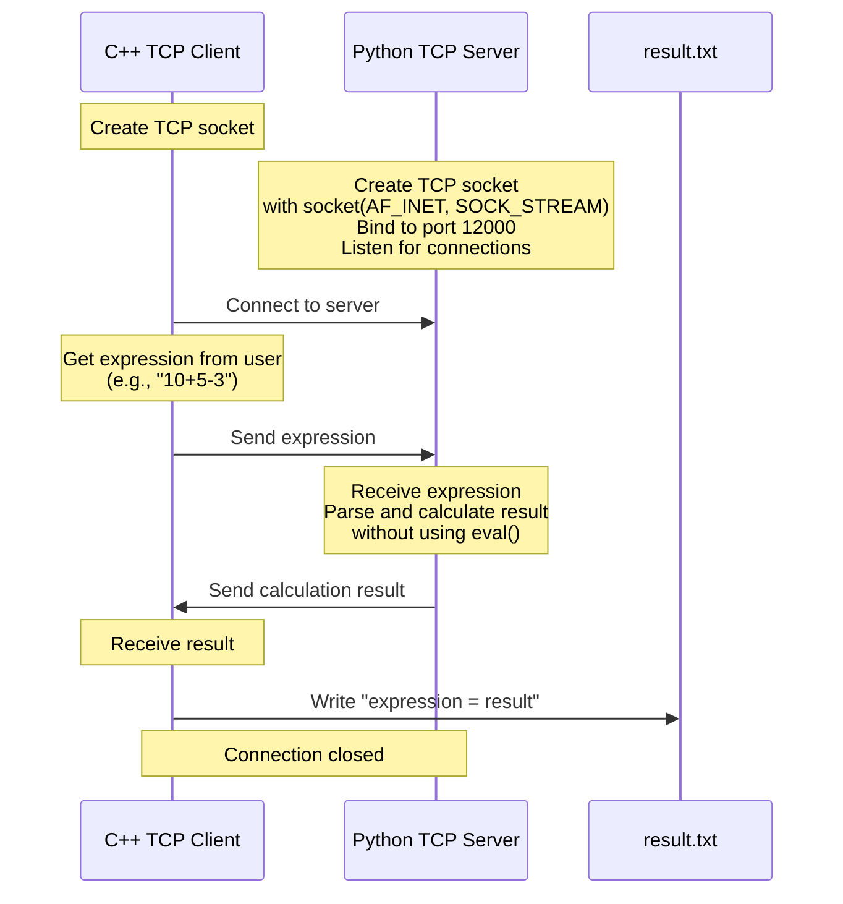
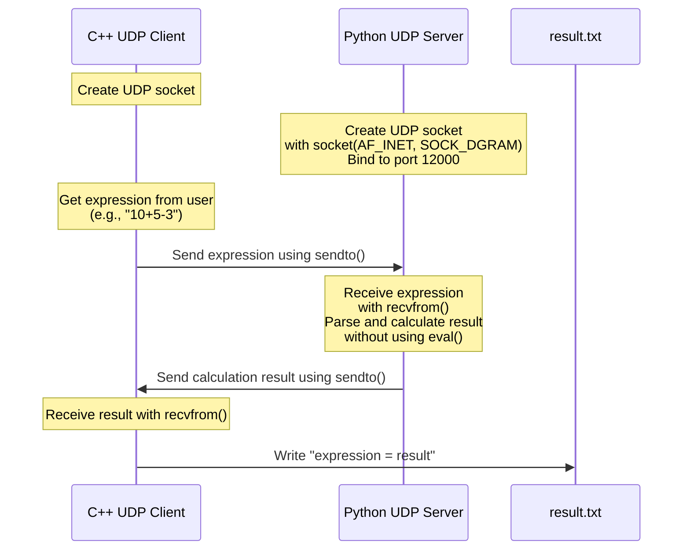

# Assignment 1 Communication Flow Diagrams

## TCP Client-Server Communication

## UDP Client-Server Communication

## Implementation Details

### TCP Version
- **Server (Python)**:
  - Creates a socket with `socket(AF_INET, SOCK_STREAM)`
  - Binds to the localhost (`127.0.0.1`) on port `12000`
  - Listens for client connections
  - Upon connection, receives expression, calculates result, sends back the result
  
- **Client (C++)**:
  - Creates a TCP socket
  - Connects to the server at `127.0.0.1:12000`
  - Gets user input for expression
  - Sends expression to server
  - Receives calculation result
  - Saves result to `result.txt`

### UDP Version
- **Server (Python)**:
  - Creates a socket with `socket(AF_INET, SOCK_DGRAM)`
  - Binds to the localhost (`127.0.0.1`) on port `12000`
  - Waits for datagrams from clients
  - Upon receipt, calculates result, sends back the result
  
- **Client (C++)**:
  - Creates a UDP socket
  - Gets user input for expression
  - Sends expression to server using `sendto()`
  - Receives calculation result using `recvfrom()`
  - Saves result to `result.txt`
