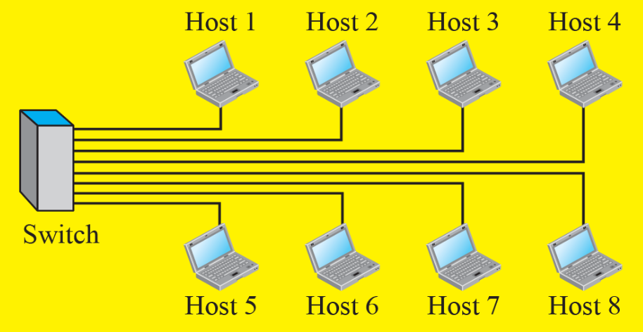

# Overview of the Internet

## Connecting devices

### 스위치 (Switch)

- 로컬 네트워크(LAN) 내의 장치들을 연결하여 데이터 프레임을 전달하는 장비
- OSI 7계층 중 2계층(Data Link Layer)에서 동작하며, MAC 주소를 기반으로 통신을 중계
- 역할
  - LAN 내 장치 간 통신 중계
  - MAC 주소 테이블을 이용하여 프레임을 목적지 포트로만 전달
  - 충돌 도메인을 분리하여 네트워크 성능 향상

### 라우터 (Router)

- 서로 다른 네트워크 간의 통신을 가능하게 해주는 장비
- OSI 7계층 중 3계층(Network Layer)에서 동작하며 IP 주소 기반으로 패킷을 전달
- 역할
  - 서로 다른 네트워크(서브넷 포함) 간의 패킷 라우팅
  - 인터넷 접속을 위한 게이트웨이 역할 수행
  - 목적지 IP 주소에 따라 최적 경로 선택
  - NAT, DHCP, 방화벽 등의 기능 제공

### 모뎀 (Modem)

- 디지털 신호와 아날로그 신호 간의 변환을 담당하는 장비
- 통신사(ISP)와 사용자의 네트워크 사이를 연결해주는 역할
  MOdulator와 DEModulator의 합성어입니다.
- 역할
  - 디지털 ↔ 아날로그 신호 변환
  - ISP와 직접 연결하여 인터넷 신호 수신 및 송신
  - DSL, 케이블, 광인터넷(FTTH) 등 다양한 형태 존재

## LAN (Local Area Network)



```
privately owned,
connects some host in a single office, building, or campus
```

- 근거리 통신망
- 일반적으로 동일한 건물 내의 작은 지리적 영역 내에 포함된 네트워크
- **host** 가 **switch** 에 직접 연결되어 있는 형태
- host를 상호 연결
- WIFI 네트워크가 대표적 예시

## WAN (Wide Area Network)

- 먼 거리에 있는 컴퓨터 그룹을 연결하는 대규모 컴퓨터 네트워크
- 넓은 지리적 영역에 걸쳐 분산된 모든 대규모 네트워크
- 스위치, 라우터, 모뎀 등의 connecting device 들을 상호연결
- 인터넷 자체도 WAN으로 간주

### Point-to-Point WAN


```
network that connects two communicating devices
through a transmission media (cable or air).
```

- 두 지점을 **전용 회선(dedicated line)** 으로 직접 연결하는 WAN 방식
- 일종의 **전용 연결(dedicated connection)** 으로, 사용자 두 명 또는 두 지점 사이에 물리적으로 고정된 회선을 제공
  - 통신 시 다른 네트워크나 경로를 거치지 않고 오직 지정된 전용 회선만 사용
  - 두 장비(예: 두 라우터)가 물리적인 링크로 1:1로 연결

**장점**

- 보안성이 높음 (다른 사용자가 접근할 수 없음)
- 지연이나 충돌이 거의 없음 (전용 회선이므로)
- 고정된 대역폭 보장

**단점**

- 비용이 매우 높음 (전용 회선을 항상 유지해야 하므로)
- 유연성 부족 (지점 추가 시 새로운 회선 설치 필요)
- 자원의 낭비 가능성 (비활성 시에도 회선 유지)

### Switched WAN


```
combination of several point-to-point WANs
that are connected by switches
```

- 스위치로 연결된 point-to-point WAN의 조합
- 여러 사용자가 공유하는 공유 회선을 통해 목적지와 연결되는 WAN 방식
- 데이터 전송 시 마다 네트워크가 경로를 동적으로 설정하고 연결을 수립
  - 사용자 데이터가 네트워크 스위치를 통해 전송되며, 패킷 또는 회선 기반 스위칭으로 경로가 결정
- 전송 방식에는
  - **회선 교환(circuit-switched)**
  - **패킷 교환(packet-switched)**
  - ...

**장점**

- 비용이 저렴함 (회선을 공유하므로)
- 유연성 높음 (노드 추가가 쉬움)
- 자원 효율성 (요구 시에만 자원 사용)

**단점**

- 공유망이므로 보안성 낮음
- 지연과 혼잡 발생 가능
- QoS(서비스 품질) 보장이 어렵거나 추가 기술이 필요

## Internetwork

- 두 개 이상의 네트워크가 연결되면, Internetwork 가 만들어짐
- 한 개 이상의 WAN이 있어야 Internetwork 라고 부를 수 있을 듯

## Switching

```
An internet is a switched network
in which a switch connects at least two links together.
```

### 회선 교환(circuit-switched)


```
A dedicated connection, called a circuit,
is always available between the two end systems
```

- 통신을 시작하기 전에 **송신자와 수신자 사이에 고정된 전용 통신 경로(회선)** 를 먼저 설정한 후 데이터가 전송되는 방식
- 통신이 종료될 때까지 이 회선은 독점적으로 사용

**동작**

1. 연결 설정 단계: 송신자와 수신자 사이에 고정된 경로를 설정
2. 데이터 전송 단계: 설정된 경로를 통해 연속적으로 데이터 전송
3. 연결 해제 단계: 통신 종료 후 회선 해제

**특징**

- 전용 경로를 사전에 확보
- 고정 대역폭 제공
- 지연(latency)이 일정함
- 자원이 비효율적으로 사용될 수 있음 (사용 중이지 않아도 회선 유지)

**예시**

- 전통적인 유선 전화망(PSTN)
- ISDN(Integrated Services Digital Network)

**장점**

- 일정한 품질 보장(QoS)
- 지연이 거의 없음
- 실시간 통신(음성/영상)에 적합

**단점**

- 비효율적인 자원 사용 (회선 점유)
- 연결 설정 시간이 필요
- 트래픽이 없는 시간에도 회선은 유지됨

### 패킷 교환(packet-switched)


```
The communication between the two ends is done
in blocks of data called packets
```

- 데이터를 **작은 단위의 패킷(packet)** 으로 나누고, 각 패킷을 독립적으로 전송하며, 최종 목적지에서 이를 다시 조립하는 방식
- 회선을 고정하지 않고, 공유된 네트워크 자원을 이용
- packet switched network 의 라우터는 패킷을 저장하고 전달하는 queue 를 가짐

**동작**

1. 송신자가 데이터를 패킷 단위로 분할
2. 각 패킷은 독립적으로 경로를 선택하며 전송
3. 수신자는 수신된 패킷을 재조합하여 원래의 데이터 복원

**특징**

- 고정된 경로 없이 패킷별로 독립적 전송
- 네트워크 자원 공유
- 트래픽량에 따라 지연과 경로 변화 발생 가능
- 효율적인 자원 사용

**예시**

- **인터넷**
  - user가 ISP (Internet Service Provider) 에 연결되어 있어야 함
  - 물리적 연결은 point-to-point WAN을 통해 이루어짐
  - 데이터 전송은 packet-switched 방식으로 이루어짐
- VoIP, 이메일, 웹 브라우징

**장점**

- 네트워크 자원을 효율적으로 사용
- 다수의 사용자 지원에 적합
- 비용이 저렴하고 유연성 높음

**단점**

- 전송 지연과 패킷 손실 가능성 존재
- 패킷 순서가 바뀔 수 있음 (재정렬 필요)
- QoS 보장이 어렵거나 추가 기술 필요
