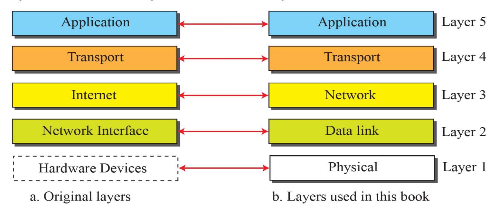
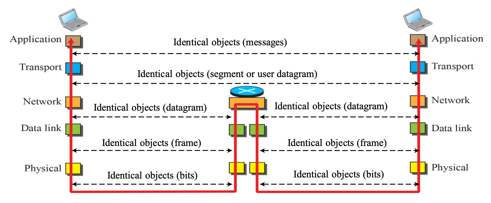

# Protocol Layering

## Protocol

```
A protocol defines the rules that both the sender and receiver
and all intermediate devices need to follow to be able to communicate effectively
```

- sender와 receiver 가 데이터를 주고받기 위해 따라야 하는 규칙
- 통신이 복잡한 경우, 각 layer에서 protocol을 정의 = protocol layering

## Protocol Layering


- 네트워크 통신 과정을 여러 **기능적 계층(layer)** 으로 나누어, 각 계층이 특정 역할만 담당하도록 구조화
- 네트워크 통신을 논리적으로 분할함으로써 복잡성을 줄이고 표준화를 용이하게

### Identical Objects (동일한 객체)

- 네트워크 통신을 하는 두 시스템에서 **동일한 계층에 존재하면서 동일한 프로토콜을 기반으로 동작하는 구성 요소**
- 실제로는 물리적으로 연결되어 있지 않지만, 서로 동일한 규칙에 따라 동작하여, **논리적으로 직접 통신 (logical connection)** 하는 것처럼 동작
- 네트워크 구조를 모듈화하고 추상화하는 데 필수적

## TCP/IP Protocol



- 인터넷과 같은 네트워크에서 데이터를 송수신하기 위해 사용하는 프로토콜 집합(protocol suite)
- TCP는 신뢰성 있는 데이터 전송을, IP는 주소 지정 및 패킷 전달 경로 설정을 담당
- 5개의 계층으로 구성 (과거 4계층, 현재 Physical layer 추가되어 5계층)
  - 응용 계층 (Application Layer)
  - 전송 계층 (Transport Layer)
  - 인터넷 계층 (Network Layer)
  - 링크 계층 (Data Link Layer)
  - 물리 계층 (Physical Layer)

### TCP/IP Protocol 에서의 라우터, 스위치


- 라우터 (router):

  - 3계층 (Internet Layer)
  - 데이터 패킷이 목적지(특정 LAN)까지 찾아갈 수 있도록 경로 선택
  - by IP address

- 스위치 (switch):

  - 2계층 (Link Layer)
  - 데이터 프레임이 목적지(특정 Host)까지 찾아갈 수 있도록 경로 선택
  - by MAC address

### 5계층

#### application layer

- 두 개의 process가 서로 통신하기 위해 사용하는 인터페이스
- process가 request를 보내고 response을 받는 것을 처리
- process-to-process communication

#### transport layer

- application layer에게 서비스를 제공하는 역할
- 출발지 호스트의 응용 프로그램에서 생성된 메시지를, 목적지 호스트의 해당 응용 프로그램으로 정확하게 전달
- End-to-End Process Communication (송수신 프로세스 간 통신)

#### network layer

- 출발지 호스트와 목적지 호스트 간 연결을 구성하고, **패킷의 전송 경로(Route)**를 결정
- host-to-host communication

#### data link layer

- 호스트에서 라우터 또는 라우터 간 한 링크 내에서의 전송을 담당
- 실제 경로는 여러 링크로 구성되어 있으며, 각 링크를 하나씩 건너는 데 책임을 짐
- 라우터가 다음 경로를 결정하면, 해당 링크를 통해 데이터를 전송하는 역할을 이 계층이 수행
- Node-to-Node (직접 연결된 두 장치 간 통신)

#### physical layer

- 비트 단위의 데이터를 실제 전기적/광학적 신호로 변환하여 전송
- 네트워크의 하드웨어적 측면에 해당하며, 케이블, 커넥터, 전압 수준 등을 포함

### 각 계층에서의 Identical Objects



- application layer: message
- transport layer: segment or user datagram
- network layer: datagram
- data link layer: frame
- physical layer: bits

### 각 계층에서의 Address


- application layer: names
- transport layer: port number
- network layer: IP address (logical address)
- data link layer: MAC address (physical address)
- physical layer: none

### Encapsulation / Decapsulation

#### 캡슐화 (Encapsulation)

- 데이터를 **상위 계층에서 하위 계층으로** 전달할 때, **각 계층의 헤더 정보를 붙여** 전송
- 예: Application data → TCP 헤더 → IP 헤더 → Ethernet 헤더 → 전송

#### 비캡슐화 (Decapsulation)

- 수신 측에서 **하위 계층부터 상위 계층** 까지 **헤더를 제거하며** 해석
- 예: 전송 → Ethernet 헤더 → IP 헤더 → TCP 헤더 → Application data

### Multiplexing / Demultiplexing

#### Multiplexing (송신 측)

```
encapsulte a packet
from several next higher layer protocol
one at a time
```

- **여러 응용 계층 프로토콜(FTP, HTTP, DNS 등)** 에서 내려온 데이터를
- **하나의 전송 계층 프로토콜(TCP 또는 UDP)** 이 수신하여 IP 계층으로 보내는 과정

즉, 여러 상위 프로토콜 → 하나의 하위 프로토콜로 집약하는 동작

#### Demultiplexing (수신 측)

```
decapsulate and deliver a packet
to several next higher layer protocol
one at a time
```

- 수신된 IP 패킷을 기반으로
- IP 계층 → 전송 계층(TCP 또는 UDP) → 적절한 응용 계층 프로토콜로 데이터를 분기하여 전달하는 과정

즉, 하나의 하위 프로토콜 → 여러 상위 프로토콜로 분배하는 동작

## OSI Model


- ISO에서 제안한 모델
- 7개의 계층으로 구성
- application layer가 application / presentation / session layer로 세분화
