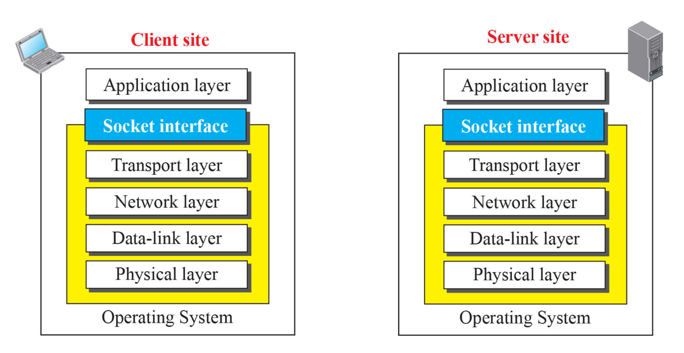
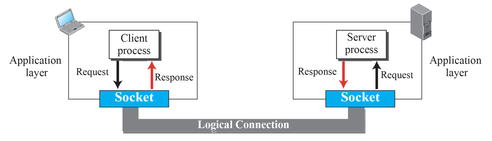
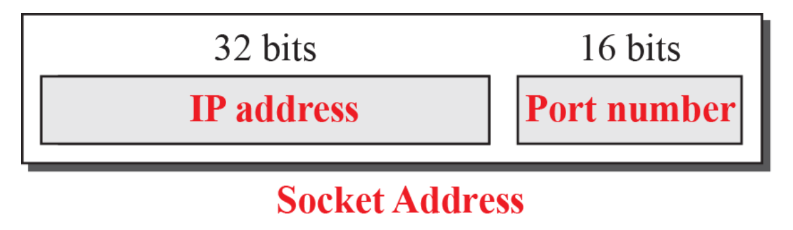

# Client-Server Paradigm

## Application Programming Interfaces (APIs)

프로그램이 다른 프로그램을 사용할 수 있도록 하는 인터페이스

## Socket Interface

### socket

- application 프로그램에 의해 만들어지고 사용되는 data structure
- physical entity가 아님
- sink 이자 source
  - socket으로 부터 데이터를 읽고
  - socket에 데이터를 쓸 수 있음
- client는 socket을 요청을 받고 응답을 보내는 entity로 인식
- server는 socket을 요청을 가지고 있고, 응답을 필요로하는 entity로 인식

### socket interface

- application layer와 os 사이의 통신을 제공하는 set of interfaces
- UC 버클리에서 1980년대 초에 개발됨

### Socket Adress

- 클라이언트와 서버 간 통신은 **양방향(two-way)** 통신

  - 단방향이 아니라, 요청도 보내고 응답도 받아야 하기에

- 이 양방향 통신을 위해선 **두 쌍의 주소 정보** 가 필요

  - **Local Address**: 현재 자기 자신의 주소 (IP + Port)
  - **Remote Address**: 통신 상대방의 주소 (IP + Port)

- 인터넷에서 실제 통신은 **소켓(socket)** 을 통해 이루어짐

  - 소켓 = IP 주소 + 포트 번호로 구성된 통신 단위.

- 결국 클라이언트와 서버가 통신하려면, **“(내 IP, 내 포트) ↔ (상대 IP, 상대 포트)”** 이 두 쌍의 소켓 주소가 정확히 맞물려야 데이터가 오고 감.

- 이걸 흔히 **소켓 주소(socket address pair)** 라고 부르고, 네트워크 프로그래밍에서 통신의 기본 단위

#### Server 측

- **Local Socket Address (서버 고정 주소)**

  - 운영체제가 제공
  - **IP 주소**: 서버가 실행 중인 컴퓨터의 IP
  - **Port 번호**: 서버가 실행될 때 **프로그래머가 지정하거나 OS가 할당**
  - 서버 실행 중에는 이 주소는 **고정값**
  - 클라이언트가 이 주소를 알아야 접속 가능

- **Remote Socket Address (클라이언트 주소)**
  - **클라이언트가 접속 요청을 보낼 때 결정됨**
  - 이 주소는 **각 클라이언트마다 다름**
  - 따라서 서버는 클라이언트가 여러 명일 경우, **각 클라이언트의 remote address**를 구분해서 관리함 → **클라이언트와 1:1 연결**의 핵심

#### Client 측

- **Local Socket Address (클라이언트 주소)**

  - 운영체제가 제공
  - **IP 주소**: 클라이언트가 실행되는 컴퓨터의 IP
  - **Port 번호**: 클라이언트가 서버와 통신하려 할 때 **운영체제가 동적으로 할당**
  - 이 주소는 통신이 시작될 때 정해지고, 통신이 끝나면 사라질 수 있음

- **Remote Socket Address (서버 주소)**
  - 클라이언트가 직접 입력하거나 설정
  - **IP 주소**와 **포트 번호**를 정확히 알아야 서버에 연결 가능
  - IP 주소는 **직접 입력하거나**, **도메인 이름(DNS)** 을 통해 해석할 수 있음 (예: `google.com` → IP로 변환됨)
