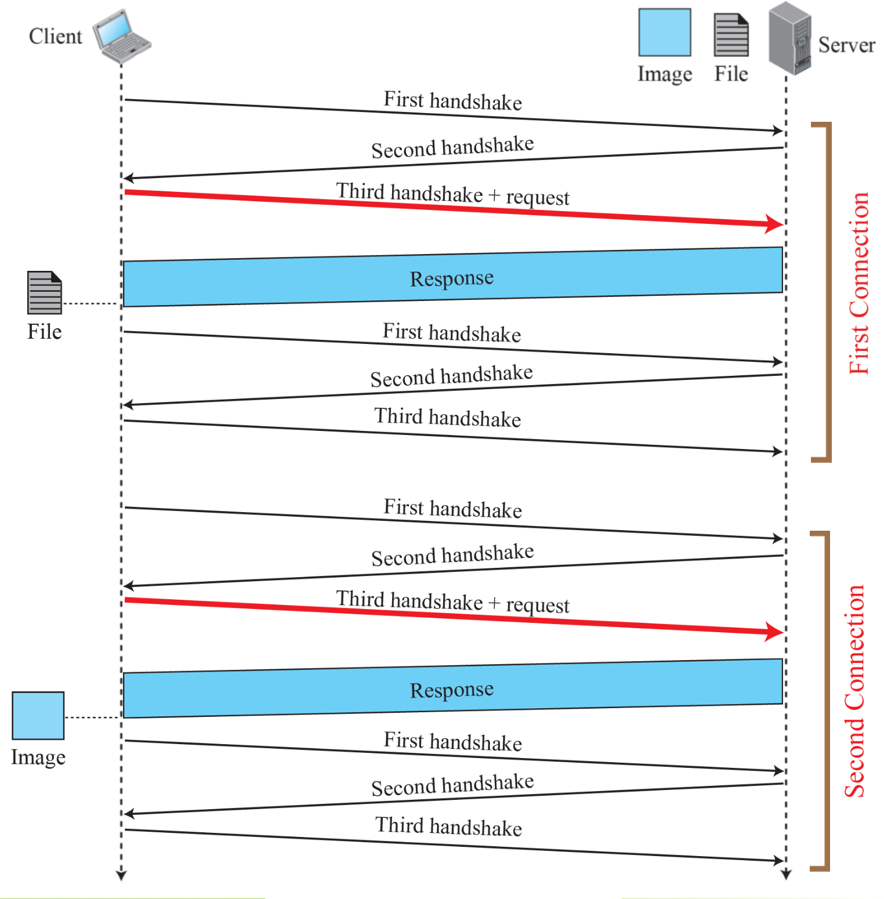
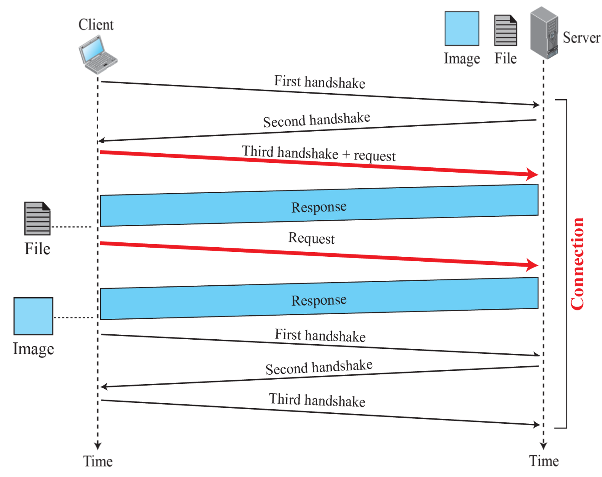
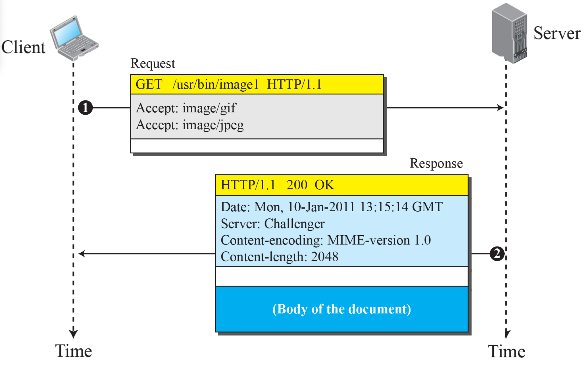
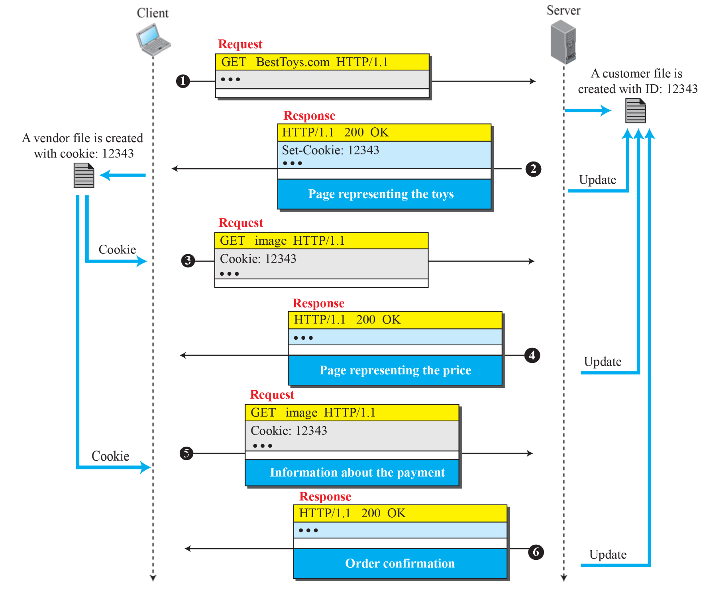
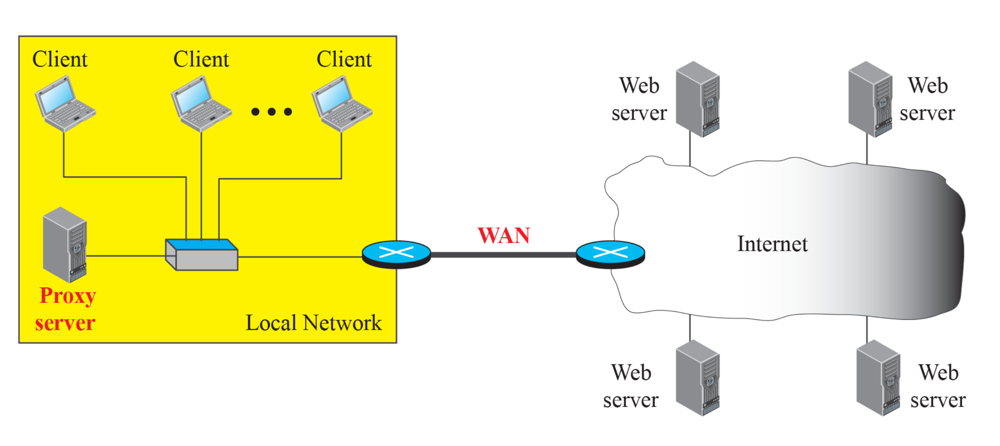
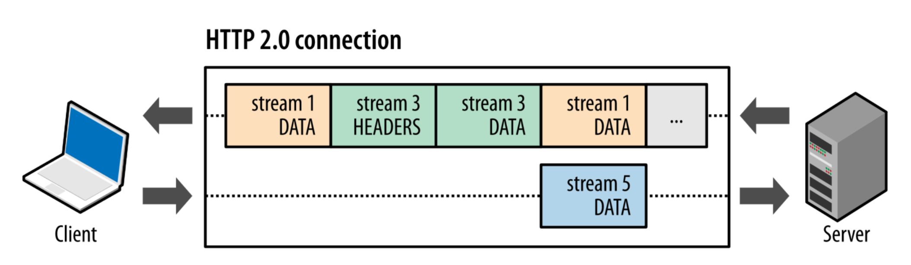
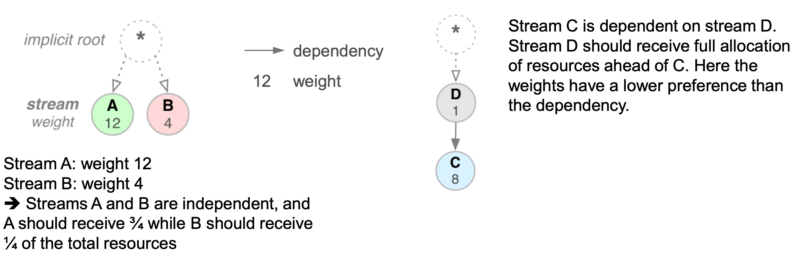
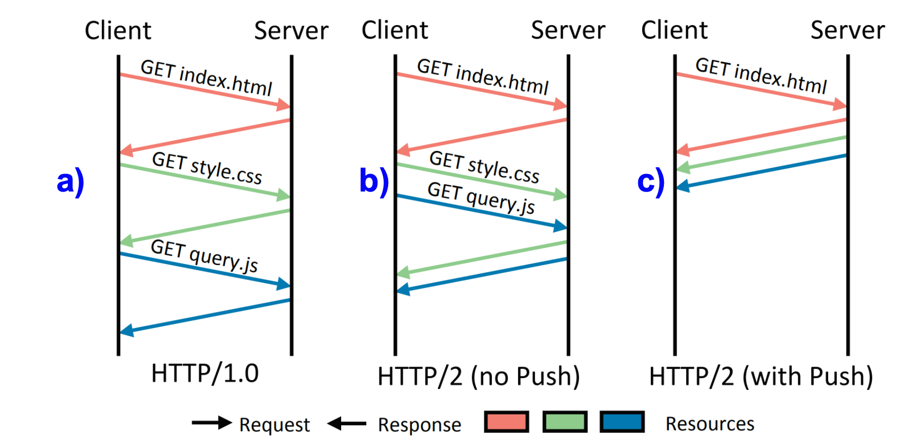

# World Wide Web

## Web

- 1989년, 팀 버너스 리(Tim Berners-Lee)가 **CERN(유럽 입자 물리 연구소)** 에서 웹의 개념을 처음 제안
- 전 세계에 퍼져 있는 **문서(웹 페이지)** 들을 연결해주는 정보 저장소
- 단순한 문서 조회를 넘어서 전자 상거래, 게임, 인터랙티브 서비스까지 지원하는 플랫폼으로 진화
- 분산된 클라이언트-서버 구조. 즉, 사용자는 **브라우저(클라이언트)** 를 통해 서버에 요청을 보내고, 서버는 웹 페이지를 제공

## Web Client (browser)

- 컨트롤러 – 사용자 입력 처리
- 클라이언트 프로토콜 – HTTP 같은 통신 프로토콜
- 인터프리터 – HTML, CSS, JS 등을 해석해서 화면에 보여줌

## Web Server

- 웹 페이지 파일 저장소
- 클라이언트 요청이 오면 문서를 전송
- 성능 향상을 위해:
  - 캐싱: 자주 요청되는 파일은 메모리에 저장 → 디스크보다 빠름
  - 멀티스레딩 / 멀티프로세싱: 여러 요청 동시 처리 가능

## URL (Uniform Resource Locator)

- 웹 페이지를 유일하게 식별하기 위한 주소체계
- 4가지 구성요소:
  - 프로토콜 – http, https 등
  - 호스트 – 서버의 IP나 도메인 이름
  - 포트 번호 – 보통 기본값 사용 (HTTP는 80, HTTPS는 443)
  - 경로(Path) – 파일의 위치와 이름

## Web Document

### Static Document (정적 문서)

- 서버에 고정된 형태로 저장
- 클라이언트는 복사본만 받아볼 수 있음
- 사용 언어: HTML, XML, XSL, XHTML

### Dynamic Document (동적 문서)

- 클라이언트 요청 시 서버에서 생성
- 예: 서버 시간/날짜 보여주는 페이지
- 사용 언어: CGI, JSP, ASP, ColdFusion

### Active Document

- 클라이언트 측에서 직접 실행되는 프로그램
- 예: 자바스크립트로 동작하는 인터랙션
- 사용 언어: JavaScript, Java(Applet)

## Hypertext Transfer Protocol (HTTP)

- 웹에서 클라이언트(브라우저)와 서버가 통신할 때 사용하는 프로토콜
- 클라이언트(보통 브라우저)가 서버에 요청(request)을 보내고, 서버는 응답(response)을 보냄
- TCP를 사용

### 특징

- 클라이언트-서버 모델
  - 클라이언트(보통 브라우저)가 서버에 요청(request)을 보내고, 서버는 응답(response)을 보냄.
- 비연결성(Connectionless)
  - 한 번 요청하고 응답 받으면 그 연결은 바로 끊긴다.
  - 매 요청마다 새 TCP 연결을 만듦
- 무상태성(Stateless)
  - 이전 요청에 대한 정보 기억 안 함.
  - 매 요청은 독립적. 그래서 쿠키나 세션 같은 걸로 상태 관리함.
- 텍스트 기반
  - 사람이 읽을 수 있는 텍스트 형식으로 구성됨
  - 디버깅도 쉽고, 패킷도 눈으로 분석 가능.

### 3 way handshake for non-persistent connection

- 1st handshake: 클라이언트가 서버에 연결 요청
- 2nd handshake: 서버가 클라이언트에 응답
- 3rd handshake: 클라이언트가 서버에 응답 확인과 함께 request 보냄
- response: 서버가 클라이언트에 응답

> 연결 종료 시에도 3 way handshake 과정 (request, response 제외) 반복

### 3 way handshake for persistent connection

- 1st handshake: 클라이언트가 서버에 연결 요청
- 2nd handshake: 서버가 클라이언트에 응답
- 3rd handshake: 클라이언트가 서버에 응답 확인과 함께 request 보냄
- response: 서버가 클라이언트에 응답
- 다음 request는 연결 유지된 상태로 보냄

> 연결 종료 시에도 3 way handshake 과정 (request, response 제외) 반복

### Methods

- `GET`: 서버에서 리소스를 가져옴
- `POST`: 서버에 데이터를 보냄
- `PUT`: 서버에 리소스를 업데이트
- `DELETE`: 서버에서 리소스를 삭제

### Status Code

- `1xx`: 정보
- `2xx`: 성공
- `3xx`: 리다이렉션
- `4xx`: 클라이언트 오류
- `5xx`: 서버 오류

### Request / Response

**Request**

- 클라이언트가 서버에 요청
- 요청 메서드, 요청 URL, 헤더, 바디 등으로 구성

**Response**

- 서버가 클라이언트에 응답
- 상태 코드, 헤더, 바디 등으로 구성

### Cookies

- 서버가 클라이언트에 대한 정보를 기억하기 위해 사용함
- HTTP는 상태 기억 못 하니까 쿠키로 대신 기억

**쿠키 생성**

1. 서버 → 클라이언트로 응답 보낼 때, Set-Cookie 헤더에 쿠키 정보 담음
2. 클라이언트(브라우저)는 이 쿠키를 자신의 쿠키 디렉토리에 저장

**쿠키 사용**

1. 클라이언트가 다음에 같은 서버에 요청을 보낼 때,브라우저는 쿠키 디렉토리를 확인해서 해당 서버의 쿠키가 있으면 요청에 자동으로 포함시킴
2. 서버는 이를 통해 클라이언트의 상태를 파악할 수 있음 (이전 사용자인지, 새로운 유저인지)

### Web Caching: Proxy Server

클라이언트와 실제 서버 사이에 껴 있는 중간 서버로 최근에 요청된 데이터(응답)를 캐시(Cache)

**작동방식**

1. 클라이언트가 요청을 프록시 서버에 보냄
2. 프록시 서버는 자기 캐시에 요청된 데이터가 있는지 확인
   - 있으면 → 그걸 그대로 응답함 (원 서버 안 거침, 속도 빠름)
   - 없으면 → 진짜 서버로 요청을 보냄
3. 응답이 오면 → 그걸 프록시 서버가 저장하고, 클라이언트한테 전달함
   - 다음에 같은 요청 오면 빠르게 재사용 가능

**장점**

- 서버 부하 감소: 원래 서버가 같은 요청 계속 처리 안 해도 됨
- 네트워크 트래픽 감소: 같은 리소스를 여러 명이 캐시에서 공유
- 지연(latency) 줄어듦: 프록시가 가까운 위치에 있으니까 빠름

**위치**

- 클라이언트 단

  - 사용자가 자기 컴퓨터에 로컬 캐시 유지
  - 자주 쓰는 요청 빠르게 처리 가능

- 회사 내부(LAN)

  - 회사 전체 직원들이 같은 프록시 서버 공유
  - 인터넷 트래픽 줄이고 응답 빨라짐

- ISP 수준

  - 인터넷 서비스 제공업체가 자사 고객들을 위해 둠
  - 지역망 전체의 외부 트래픽 크게 감소시킴

계층적(Hierarchical) 으로 쌓으면 캐싱 효율은 올라가고, 서버 부담은 더 내려감

**캐시 업데이트 전략**

- 일정 기간 동안 정보가 바뀌지 않는 사이트 목록 유지 (예: 공지사항, 회사 주소 페이지)
- 응답 헤더에 마지막 수정 시각 포함 (서버가 “이거 바뀌었는지 아닌지” 알려줄 수 있음)
- 조건부 요청 사용 (클라이언트가 “이거 아직 유효한지” 물어봄)

### HTTP/1.1

- Persistent Connection (Keep-Alive)
  - 하나의 TCP 연결로 여러 요청 가능하지만
  - 요청은 여전히 순차적임
- 헤더 크기 큼
  - 요청마다 똑같은 헤더를 반복적으로 보냄
  - 낭비 심함

### HTTP/2

**binary 프로토콜**

- 메시지를 바이너리 프레임 단위로 쪼갬
- 요청과 응답의 오버헤드와 대역폭 요구 줄임

**헤더 압축**

- 중복된 헤더 값들을 압축해서 전송
- 트래픽 대폭 감소

**stream multiplexing**

- 요청/응답을 구분하는 ID 단위 스트림이 도입
- 여러 요청과 응답이 한 TCP 연결 안에서 병렬로 동작 가능
- 요청/응답 간 섞여도 문제 없음, ID로 구분되니까 정확히 누가 누구 응답인지 다 알 수 있음
- 스트림들 중에 뭐 먼저 처리할지를 정해주는 우선순위 부여 가능 (stream priority)
- 한 스트림이 다른 스트림에 의존적이라고 선언 가능 (stream dependency)

**server push**

- 서버가 미리 필요한 리소스를 알고, 클라이언트 요청 전에 먼저 밀어넣을 수 있음

### HTTP/3

- **기존 TCP 대신 QUIC(Quick UDP Internet Connection)** 를 전송 계층으로 사용하는 최신 HTTP 프로토콜
- HTTP/2는 스트림 병렬 전송 가능하지만,TCP는 패킷 하나만 유실돼도 모든 스트림이 멈춤 = **Head-of-Line Blocking (HOLB)**
- QUIC 사용 (UDP 기반)으로 TCP 안 씀
  - UDP + TLS + 스트림 + 흐름 제어 전부 QUIC이 처리함
  - 각 스트림이 독립적이라서, → 패킷 하나 유실돼도, 다른 스트림은 영향 없음
  - 설계 자체가 병렬성 고려
