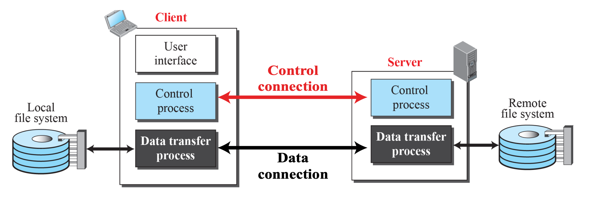
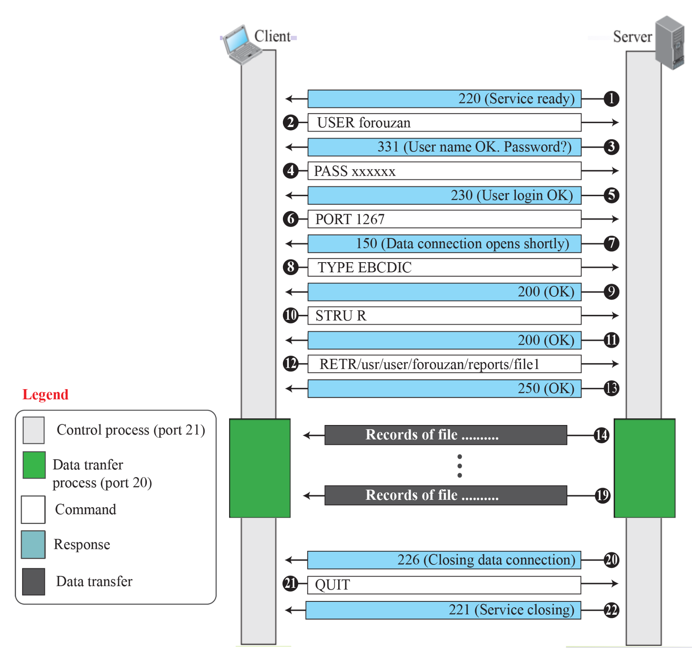

# FTP (File Transfer Protocol)

- 클라이언트와 서버 사이에서 파일을 주고받기 위한 프로토콜
- 기본적으로는 TCP 기반, 포트 21번 사용
- 구성요소는 server control process와 server data process로 나뉨
- 연결은 control connection과 data connection으로 나뉨
- 명령어와 데이터가 다른 연결을 통해 이동하기에, 제어 정보는 "Out-of-band" 라고 부름

## 작동 방식

1. 클라이언트가 서버에 연결

   - FTP 서버 주소, 포트(기본 21), 계정(ID/PW) 입력

2. 제어 연결(Control Connection) 설정

   - 사용자가 ftp 세션을 시작할때 생성되어 ftp 세션 동안 유지됨
   - 로그인/명령어 전달 등은 여기서 처리
   - 항상 포트 21로 연결

3. 데이터 연결(Data Connection) 별도로 열림

   - 실제 파일 전송은 이 경로에서 발생
   - 파일 전송이 끝나면 닫힘
   - 보통 포트 20번 사용

## Active mode for data connection

1. 클라이언트가 수동으로 포트 개방 (passive open)
2. 클라이언트가 서버에게 `PORT` 명령어 보냄
3. 서버가 접속시도 (active open)
   - 서버는 자기 쪽 포트 20에서 연결 시도함
   - 대상은 클라이언트가 알려준 IP + 포트
