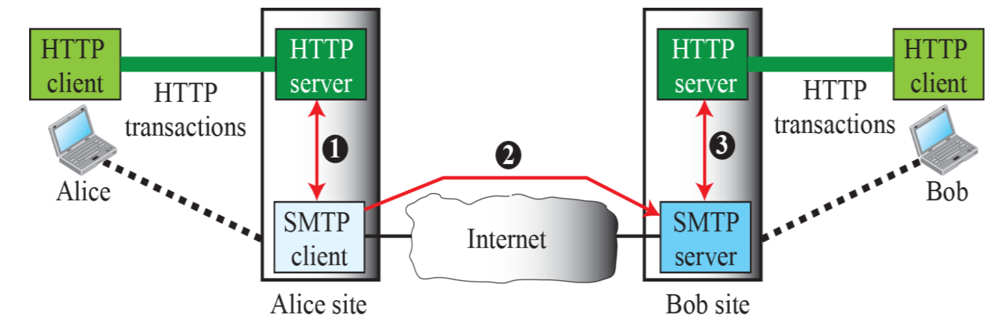

# Electronic Mail

- 비동기적이고 일방향적
- 사용자 간 직접 통신이 아닌 중간 서버를 통한 전달 방식
- 사용자는 필요할 때만 클라이언트 프로그램(UA) 실행
- 서버는 항상 동작

## 메일 주소

```
local-part@domain-name
```

- local part: 수신자의 mailbox address
- domain name: 수신자의 메일 서버 domain name

## 구성요소


### User Agent (UA)

- 사용자 인터페이스
- 역할: 메일 작성, 읽기, 회신, 전달, 저장 등
- 종류:
  - 명령형(command-driven): mail, pine, elm
  - GUI 기반: Eudora, Outlook

### Message Transfer Agent (MTA)

- 메일 전송 중계자
- 메일을 보내고 받는 과정에서의 중간 서버 역할
- 클라이언트 MTA ↔ 서버 MTA 사이에 메일 전달
- 예시 프로토콜: **SMTP**

### Message Access Agent (MAA)

- 수신된 메일 접근 제공자
- 메일 서버에서 사용자 컴퓨터로 메일 가져오는 역할
- 예시 프로토콜: **POP3**, **IMAP**

> SMTP, POP3, IMAP 모두 stateful 프로토콜

## mail transfer 3 단계


1. **연결 설정(Connection Establishment)**

   - **SMTP 클라이언트**가 **서버의 포트 25번**에 TCP 연결 시도
   - 연결되면 **SMTP 서버가 세션 시작**

2. **메시지 전송(Message Transfer)**

   - 연결이 완료되면 클라이언트가 **메일 내용 전송**
   - **수신자 한 명 이상 가능**
   - 구조:
     - 송신자 정보 (`MAIL FROM`)
     - 수신자 정보 (`RCPT TO`)
     - 메일 본문 (`DATA`)

3. **연결 종료(Connection Termination)**
   - 메일 전송이 끝나면 **클라이언트가 연결 종료 명령(SMTP: QUIT)** 전송
   - 서버는 응답 후 **TCP 세션 종료**

## POP3 (Post Office Protocol version 3)

**기본 개념**

- 메일 서버에서 메일을 **사용자 컴퓨터로 다운로드**
- 기본적으로 **다운로드 후 서버에서 메일 삭제**
- 서버에는 메일이 남지 않음 (기본 설정 기준)

**특징**

- **비연결 중심**: 다운로드 후 서버와의 연결 종료
- **로컬 저장 중심**: 메일을 로컬에서 관리
- **단말기 1개 기준 설계**: 여러 디바이스에서의 동기화 어려움

## IMAP (Internet Message Access Protocol)

**기본 개념**

- 메일을 서버에 **보관한 채로 읽고 관리**
- 다운로드하지 않고도 서버에서 직접 메일을 **읽고, 정리하고, 관리**

**특징**

- **지속적 연결**: 서버와 항상 동기화
- **서버 중심 저장**: 메일이 서버에 남아 있음
- **여러 디바이스에서 접근 가능**

## Web-based Mail (웹 기반 이메일)



**기본 개념**

- **웹 브라우저를 통해** 이메일을 송수신하는 방식
- 클라이언트에 별도 메일 프로그램 설치 없이 사용 가능
- 메일 작성, 읽기, 삭제, 정리 등을 **웹사이트에서 직접 수행**

**동작 방식**

- 사용자 → 웹 브라우저 → 웹 메일 서버 → 메일 송수신
- 실제 메일 전송 및 수신은 **서버 내부에서 SMTP, IMAP, POP3 등을 사용**
- 사용자는 그런 내부 프로토콜을 **신경 쓸 필요 없음** — 전부 웹 인터페이스로 처리됨

**특징**

- **접근성 높음**: 인터넷만 되면 어디서든 접속 가능 (PC방, 학교, 스마트폰 등)
- **설치 불필요**: 메일 클라이언트 설치 없이 웹 브라우저만 있으면 사용 가능
