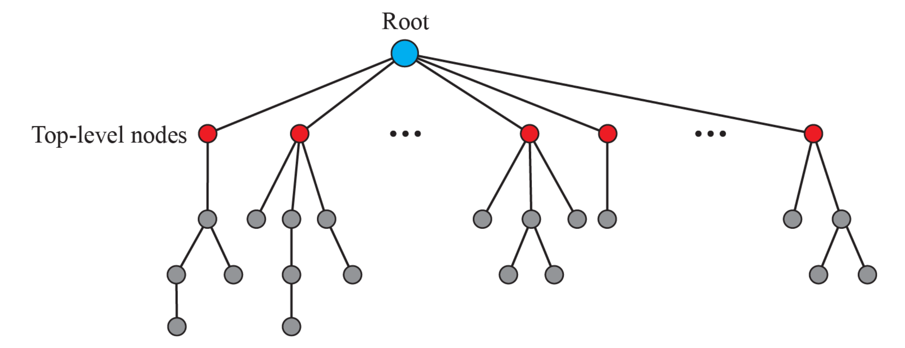

# Domain Name System

- 도메인 이름을 IP 주소로 변환해주는 시스템
- 사용자가 `www.google.com`처럼 도메인 이름으로 접근하면, 실제 통신은 숫자로 된 IP 주소(예: 142.250.206.4)를 사용함
- 이를 자동으로 매핑해주는 시스템이 DNS
- IP 주소는 기억하기 어렵고 가변적임
  - 예: `216.58.200.174` vs `www.google.com`
- 도메인 이름을 사람이 쉽게 사용할 수 있게 하고, 컴퓨터가 이해하는 IP 주소로 자동 변환해주는, 이름 → 주소 변환기 역할

## 사용 프로토콜

- **UDP**: 응답이 512바이트 이하인 경우
- **TCP**: 응답이 크거나, Zone Transfer 등 대용량 통신 시

## 핵심 역할

- 도메인 이름 → IP 주소 매핑
- 호스트 별칭 지원 (예: www → 실제 서버 이름)
- 이메일 라우팅 (MX 레코드 사용)
- 부하 분산 (여러 IP 주소를 동일 도메인에 대응)

## domain namespace (hierarchical naming system)

- `www.google.com.` 형태는 계층적으로 나눠짐
- inverted tree 구조

| 구성 요소 | 설명                     |
| --------- | ------------------------ |
| `.`       | 루트 도메인              |
| `com`     | 최상위 도메인 (TLD)      |
| `google`  | 2차 도메인 (소유자 관리) |
| `www`     | 호스트 이름 (서브도메인) |

**generic domain**

- `.com`, `.org`, `.net`, `.edu`, `.gov` 등
- 조직 유형에 따라 분류
- 약 14개의 기본 라벨 존재

**country domain**

- 국가 단위 도메인 (예: `.kr`, `.jp`, `.us`)
- 미국은 지역 세분화 (`ca.us`처럼 주 단위)

**Inverse Domain** (현재는 폐기됨)

- IP 주소 → 도메인 이름 매핑
- 현재는 RFC 3425에 따라 더 이상 사용하지 않음

## Zone

- DNS 시스템은 너무 거대하여, 책임을 나눠서 관리함
- 하나의 DNS 서버가 관리 책임을 가지는 범위, 즉 **"권한이 있는 영역"** 을 Zone이라고 부름
- 실제 서버가 책임지고 관리하는 물리적 구역
- 하나의 Domain은 여러 Zone으로 나뉠 수 있음 (서브도메인 위임 시)
- 각 Zone은 **권한 있는 네임서버(authoritative name server)** 가 존재

## 주요 서버 구성

**루트 DNS 서버**

- 도메인 구조의 **최상위**
- 모든 도메인 정보를 알고 있는 건 아니지만, **TLD 서버의 위치**는 알고 있음
- 전세계에 분산되어있음

**TLD DNS 서버**

- `.com`, `.net`, `.org` 등의 **최상위 도메인 정보** 보유
- 해당 도메인의 **권한 있는 네임서버(NS)** 정보 제공

**권한 있는 네임서버 (Authoritative DNS Server)**

- **실제 IP 주소** 정보를 가지고 있는 서버
- ex: `www.google.com → 142.250.206.4` 응답

**로컬 DNS 리졸버 (DNS Resolver)**

- 사용자의 컴퓨터나 ISP가 사용하는 DNS 캐시 서버
- DNS 질의 시, 다른 서버 대신 질의 처리하고 결과를 캐시에 저장

## Primary / Secondary 서버

- Primary: Zone 파일을 직접 관리하는 서버, 수동으로 작성/갱신
- Secondary: Primary나 다른 Secondary 서버로부터 Zone 정보를 복사하여 사용 (Zone Transfer)

## DNS 질의 과정 (이름 해석 과정)

사용자가 `www.google.com` 접속 시 내부 흐름:

1. 브라우저 → OS → **로컬 DNS 리졸버**에게 질의
2. 로컬 DNS 리졸버가 **루트 서버**에 요청  
   → `.com` TLD 서버 위치 받음
3. TLD 서버에 질의  
   → `google.com`의 권한 있는 네임서버 위치 받음
4. 권한 있는 네임서버에 질의  
   → 최종 IP 주소 받음
5. 결과를 브라우저에 전달 → 접속 완료
6. **결과는 캐시에 저장**, 이후 요청은 빠르게 처리됨

## 질의 방식 유형

| 방식                            | 설명                                                              |
| ------------------------------- | ----------------------------------------------------------------- |
| **재귀 질의 (Recursive Query)** | 요청자가 끝까지 응답 받을 때까지 대신 질의 수행 (로컬 DNS가 사용) |
| **반복 질의 (Iterative Query)** | 요청자가 직접 여러 서버에 차례로 질의                             |

## DNS 레코드 종류

| 레코드 타입 | 설명                       |
| ----------- | -------------------------- |
| **A**       | 도메인 이름 → IPv4 주소    |
| **AAAA**    | 도메인 이름 → IPv6 주소    |
| **MX**      | 메일 서버 정보             |
| **CNAME**   | 별칭 (Canonical Name)      |
| **NS**      | 네임서버 정보              |
| **TXT**     | 텍스트 정보 (SPF, 인증 등) |

## DNS 캐싱

- 응답 속도 향상을 위해 **결과를 저장**
- **TTL (Time To Live)** 시간 동안 유지
- 클라이언트, OS, 브라우저, ISP 등에서 다층적으로 캐싱함
