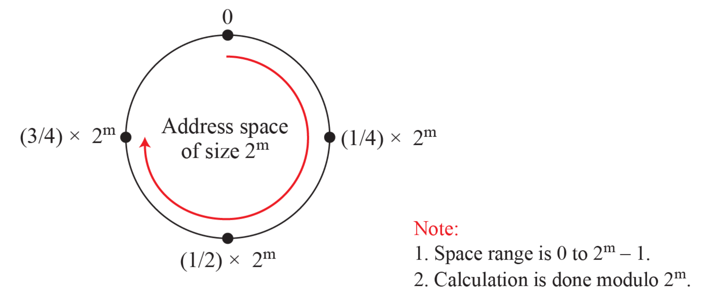
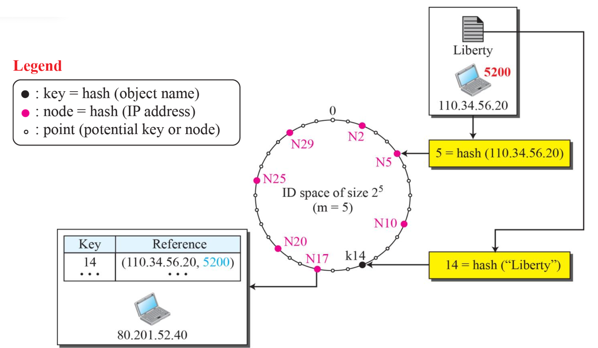

# Peer-to-Peer (P2P)

- 네트워크에 연결된 **모든 노드(peer)** 가 서버와 클라이언트의 역할을 동시에 수행할 수 있는 구조
- 한 노드는 다른 노드로부터 데이터를 받는 동시에, 다른 누군가에게 데이터를 제공하는 "대등한 참여자"
- "centralized" 와 "decentralized" 두가지 형태로 나눌 수 있음

## Centralized P2P

- 디렉터리 시스템(파일이 있는 피어 목록)은 클라이언트-서버 모델
- 중앙 서버가 검색 기능 제공
- 실제 파일 저장 및 전송은 P2P 방식으로 수행

## Decentralized P2P

- 중앙 디렉터리 없이 피어들이 **논리적 오버레이 네트워크(overlay network)** 를 구성

### Unstructured Network (비구조화 P2P)

- 피어 간 연결이 임의적이고, 별도의 조직화된 구조 없음
- 검색 효율이 낮고, 브로드캐스트(flooding) 방식으로 쿼리를 전파함
- 트래픽 과다 발생 가능, 검색 실패 확률도 존재

### Structured Network (구조화 P2P)

- 피어 간 연결이 사전에 정의된 규칙을 따름
- 데이터 검색은 **효율적인 알고리즘(DHT 등)** 을 통해 빠르게 수행 가능

## Distributed Hash Table (DHT)





- 데이터를 사전 정의된 규칙에 따라 여러 노드에 분산 저장하는 메커니즘
- 각 노드와 데이터는 동일한 주소 공간(address space) 상의 정수 값으로 변환
- 주소 공간은 일반적으로 2^m 크기이며, m=160인 경우가 많음

### Hasing Peer identifier

```
node ID = hash(Peer IP address)
```

- 각 피어(노드)는 자신의 IP 주소나 고유 식별자를 해시 함수를 통해 m-bit 정수로 변환
- 이 값은 DHT의 **논리적 원형 링(ring)** 에서의 노드 위치

### Hashing Object identifier

```
key = hash(Object name)
```

- 공유할 객체(예: 파일 이름)도 해시를 통해 m-bit key로 변환
- 이 key에 가장 가까운 node가 해당 객체의 **참조(reference)** 를 저장

### 데이터 저장 방식

> “Liberty”라는 파일을 공유하고자 한다면, 이 이름을 해싱한 key에 가장 가까운 node가 참조를 저장

- DHT는 실제 파일을 저장하지 않고, 해당 파일을 소유한 피어의 정보(위치, IP 등)를 저장
- 파일 분산은 유지하면서도, 빠른 검색이 가능

### routing

```
→ 내 neighbor 중에서 key에 더 가까운 node에게 쿼리를 넘김
→ 이 과정을 반복하여 목적 노드 도달
```

- 각 노드는 전체 네트워크 정보를 알 필요는 없으며, 일부 노드 정보만으로도 점프 방식으로 탐색 가능
- 대부분의 DHT는 `log(N)` 수준의 탐색 복잡도를 가짐

### 노드의 동적 변화 대응

> P2P 네트워크의 현실적 특성: 노드는 언제든 들어오거나 나갈 수 있다

- DHT 시스템은 노드가 입장하거나 퇴장할 때, 관련 데이터를 적절한 노드로 재분배하여 일관성을 유지해야 함
- 이를 위한 알고리즘이 DHT의 핵심 설계 포인트 중 하나

### 주요 DHT 구현 프로토콜

**Chord**

- 간결하고 직관적인 원형 링 기반 설계
- 각 노드는 **“finger table”**을 유지하여 지수 단위로 멀리 있는 노드 정보를 참조
- 탐색은 `O(log N)` 단계로 진행

**Pastry**

- 노드 ID를 접두사 기반(prefix routing)으로 분산
- 각 노드는 **라우팅 테이블, 근접 집합(neighborhood set)**을 유지
- 응답 속도와 네트워크 인접성을 고려한 구조

**Kademlia**

- BitTorrent, IPFS에서 사용되는 가장 널리 채택된 DHT 프로토콜
- **XOR 거리(metric)** 를 기반으로 라우팅
- 네트워크의 안정성과 효율성, 캐시 전략에서 매우 우수함

## BitTorrent

- 대용량 파일을 여러 사용자(peer) 간에 나누어 빠르게 공유하기 위한 P2P
- 파일은 **여러 개의 조각(chunk)** 으로 나뉘어 전송됨
- 참여자는 받은 조각을 즉시 다른 사용자에게 업로드하면서 전체 공유 네트워크에 기여
- 이 협업 단위를 **"torrent"** 라고 부름

### 구성요소

- Peer: 토렌트에 참여하는 사용자
- Swarm: 해당 토렌트에 참여 중인 모든 피어들의 집합
- Seed: 전체 파일을 모두 가지고 있는 피어
- Leech: 파일의 일부만 가지고 있고, 나머지를 다운로드 중인 피어

### Tracker 기반 BitTorrent

**tracker** = 연결을 관리하는 중앙 서버로 파일 그 자체는 갖고 있지 않음

1. 사용자는 .torrent 파일을 다운로드

   - 이 파일에는 파일 조각 구조 정보 + 트래커 서버 주소가 포함되어 있음.

2. 사용자는 트래커 서버에 접속해 **현재 Swarm 내 피어 목록(Seed/Leech)**을 받아옴.

3. 받은 피어 리스트를 바탕으로 병렬적으로 여러 피어로부터 조각들을 동시에 다운로드

### Trackerless BitTorrent

- 중앙 서버(tracker)에 의존하지 않고, Kademlia DHT 기반으로 피어를 찾음
  - key = torrent metadata 파일
  - value = 피어 목록
