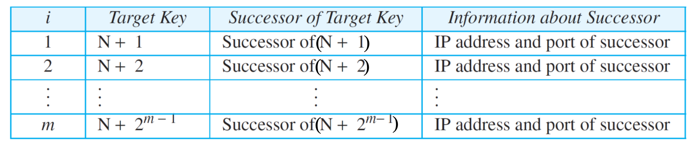
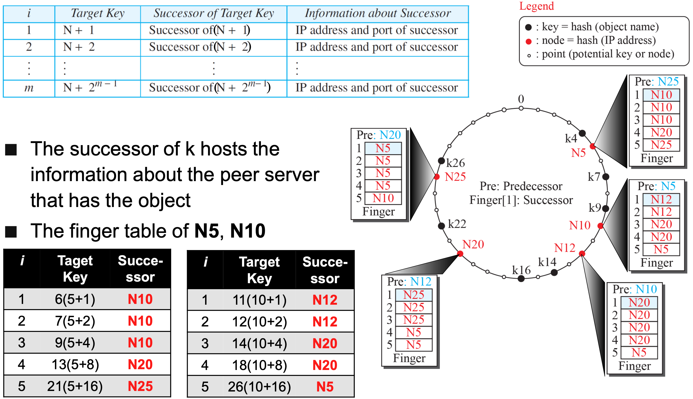

# Chord Protocol

## Identifier space (원형 ID 공간)

```
k = hash(file name)
N = hash(peer IP)
```

- 모든 노드와 데이터(key)는 2^m 크기의 원형 주소 공간 상의 한 점에 위치
- 주소 공간은 `modulo 2^m` 연산을 기반으로 구성되며, `0 ~ 2^m - 1` 범위를 가짐
- key와 node는 해시 함수를 통해 해당 위치에 배정

## responsible node (책임 노드)

- 키 k에 대해, **k보다 같거나 큰 가장 가까운 노드 N이 key의 successor**
- 이 노드는 (k, v) 쌍의 정보를 보유하지만, **실제 데이터는 별도 노드가 가지고 있을 수 있음**

## Finger table





- 노드 n의 finger table은 총 m개의 엔트리(i = 1 to m)를 가짐
- 각 엔트리는 자기 위치에서 2^(i−1) 떨어진 위치를 target key라고 했을 때, 이 target key의 successor를 가리킴
- 여기서 `finger[1]`은 바로 자기 다음의 노드를 가리킴을 알 수 있음
- finger table을 통해 **이 노드가 가지고 있는 다른 노드 정보 중에서 검색하고자 하는 key로부터 가장 가까운 노드**를 찾을 수 있음

> - 가지고 있는 노드 정보들 중 key 보다 큰 노드 중 가장 가까운 노드로 이동이 가능하도록 해줌
> - 이와 별개로 각 노드는 predecessor에 대한 정보도 가지고 있음

## Lookup (responsible node 찾기)

```
Lookup(key) {
  if (node is responsible for the key)
    return (node's ID)
  else
    return find_successor(key)
}

find_successor(id) {
    x = find_predecessor(id)
    return x.finger[1]
}

find_predecessor(id) {
    x = node // 현재 노드
    while (id not in [x, x.finger[1]])
        x = find_closest_predecessor(id)
    }
    return x

find_closest_predecessor(id) {
    for (i = m; i >= 1; i--) {
        if (x.finger[i] in [x, id])
            return x.finger[i]
    }
    return x
}
```

```
while(현재 노드의 finger[1] < key)
    현재 노드의 finger table에서 key보다 작은 가장 큰 노드로 이동

현재노드의 finger[1], 즉 successor 반환
```

- key k가 주어졌을 때, 이를 담당하는 노드의 ID를 찾아 반환
- 가장 가까운 predecessor를 찾아 그 바로 다음 노드이자 (`finger[1]`) successor를 찾아 반환
