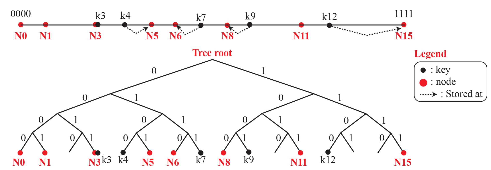
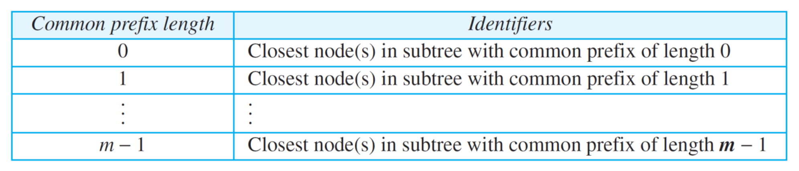
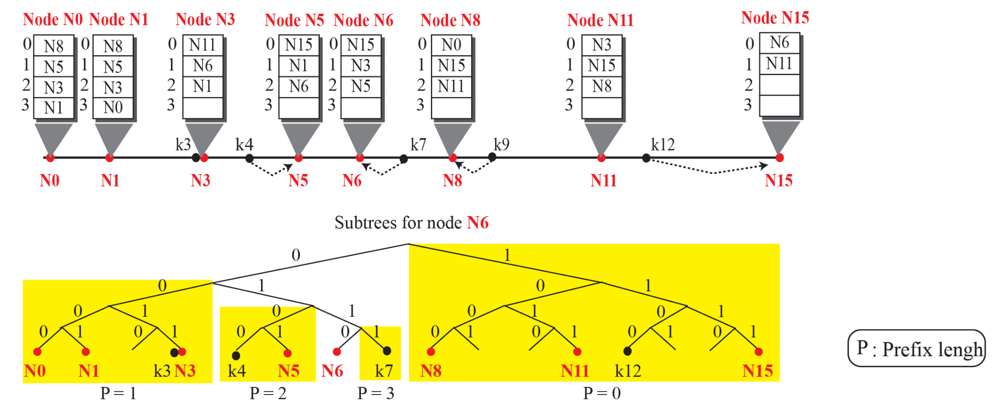

# Kademlia

- 이진 트리 위에서 XOR로 길 찾기
- 가장 가까운 이웃은, 숫자상 이웃이 아니라 bitwise XOR 거리가 가장 작은 이웃
- key와의 거리가 가장 가까운 노드가 해당 key에 대한 참조를 가지고 있음

## identifier space



- 노드 ID와 데이터 key는 모두 m비트 이진수로 구성 → 주소 공간은 2^m개의 포인트로 구성
- 두 point 간의 거리는 **bitwise XOR** 을 통해 계산됨 (숫자 차이와 다름)

## routing table





- 각 노드는 routing table의 m 개의 row에 대응하는 m개의 sub-tree를 가짐
- 각 sub-tree i 는 **i leftmost bit (common prefix)를 공유**하는 모든 노드를 포함
- 각 row는 해당 sub-tree 중 가장 가까운 노드를 가리킴 (해당 sub-tree에 노드가 없다면 null)

### k-bucket

- 효율성을 위해 각 row가 k개의 노드를 가질 수 있도록 함
- redundancy 확보로 장애 대응 가능

### α-parallelism (병렬 쿼리)

lookup 요청 시, 각 단계에서 α개 노드에게 동시에 쿼리

### Concurrent Updating

쿼리/응답 시마다 k-bucket 업데이트

## Node Join / Leave

**Join**

- 새로운 노드는 기존 노드 하나만 알면 됨
- 자신을 key로 설정하여 FIND_NODE(selfID) 요청
- 응답을 통해 자신의 주변 노드를 수집 → k-bucket 채움

**Leave / Fail**

- 명시적인 leave 없이 중단되어도, 쿼리 응답 실패가 일정 횟수 이상 반복되면 자동으로 제거
- bucket은 주기적으로 ping 및 응답 기반으로 업데이트됨

## Lookup

```
while(현재노드가 찾고자 하는 노드가 아니라면)
    현재노드와 common prefix 계산
    routing table에서 해당 prefix를 가진 노드 찾아서 이동

현재 노드 반환
```
