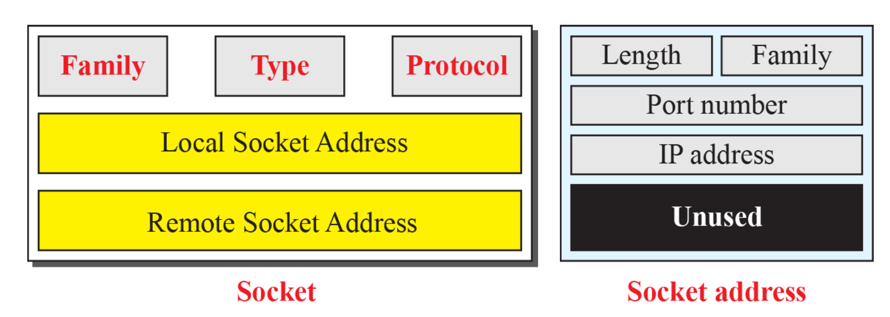
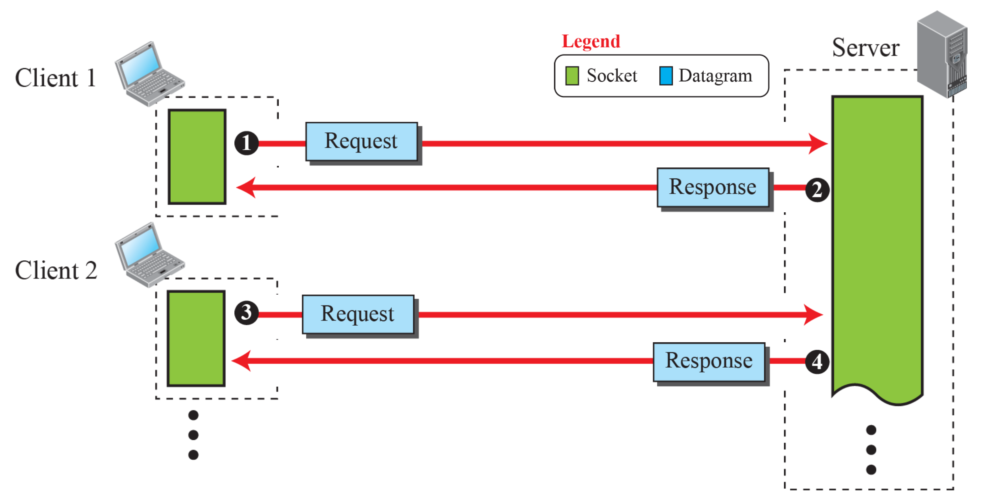
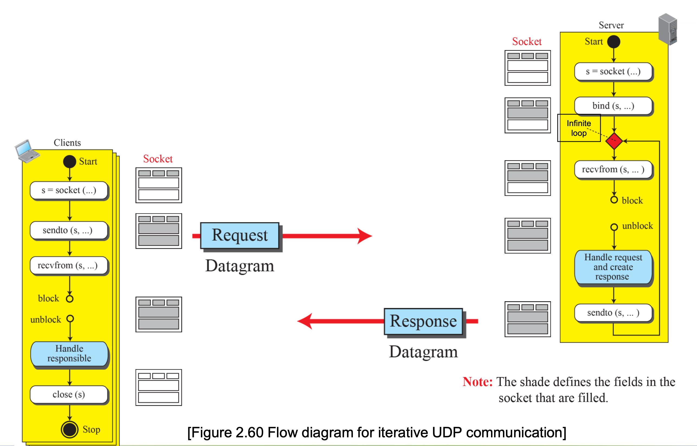
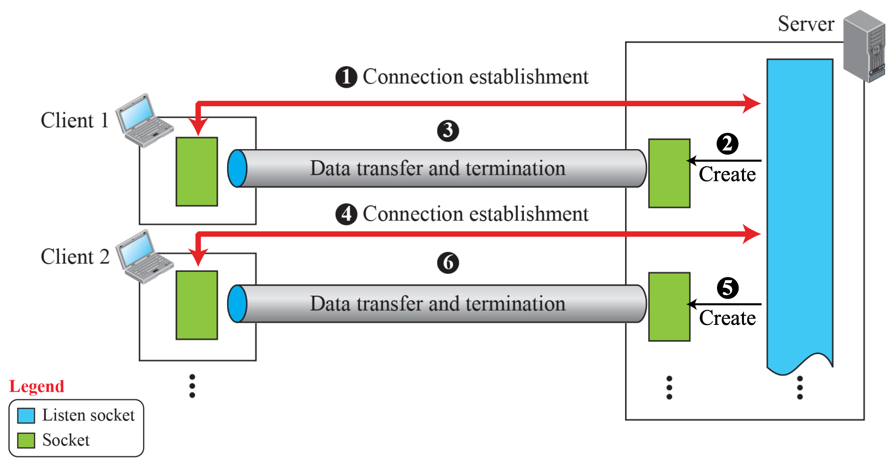
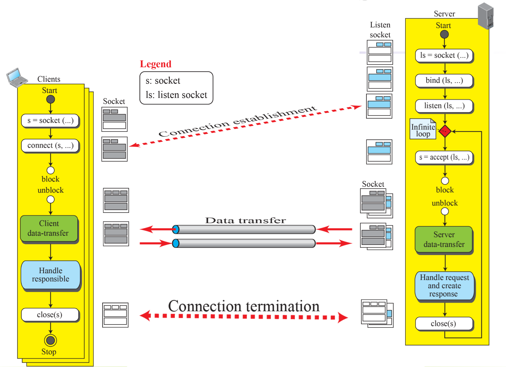

# Socket Interface Programming

- socket = 네트워크에서 실행 중인 프로세스 간 통신을 가능하게 하는 **양 끝점(endpoint)**
- 각 소켓은 IP 주소와 포트 번호로 식별됨
- TCP/UDP 등 전송 계층 위에서 동작
- 클라이언트와 서버 간의 논리적인 연결 고리

## Socket Data Structure



### socket 구조

- Family: 사용하려는 주소 체계: IPv4 (AF_INET), IPv6 (AF_INET6)
- Type: 연결 유형: SOCK_STREAM (TCP), SOCK_DGRAM (UDP), SOCKET_SEQPACKET (SCTP)
- Protocol: 사용 프로토콜: 대부분 0 (for TCP/IP protocol suite)
- Local **Socket Address**: 현재 프로그램이 바인딩된 IP + 포트
- Remote **Socket Address**: 통신 대상의 IP + 포트 (연결 성립 후 설정)

### socket address 구조

- Length: 구조체 크기 (IPv4: sizeof(sockaddr_in), IPv6는 더 큼)
- Family: 주소 체계 (AF_INET, AF_INET6)
- Port number: 통신용 포트 번호 (네트워크 바이트 순서로 저장)
- IP address: 목적지 혹은 소켓의 IP 주소
- Unused: 남는 공간 (패딩 또는 구조체 정렬 목적)

## Socket for UDP





```
socket() → bind()         // (서버용)
socket() → sendto()/recvfrom()  // (클라이언트/서버 구분 없이 모두 사용)
```

- UDP 연결에서는 client와 server가 각각 하나의 socket 만을 사용 (각 client는 자신의 socket을 가짐)
- server는 **passive open** 후, client가 연결 요청을 보내면 연결 성립
- client는 **active open** 후, 연결 성립

## Socket for TCP





- TCP: 연결 지향(Connection-oriented) 프로토콜
- 데이터 전송 전에 반드시 양방향 연결을 설정해야 함 (3-way handshake)

### TCP 서버 소켓

```
socket() → bind() → listen() → accept()
```

```c
// Listening socket 생성
int listen_fd = socket(...);
bind(listen_fd, ...);
listen(listen_fd, ...);

// 클라이언트가 접속하면:
int conn_fd = accept(listen_fd, ...);
// conn_fd로 클라이언트와 데이터 송수신
recv(conn_fd, ...);
send(conn_fd, ...);
```

- Listening Socket: 클라이언트 연결 요청을 기다림 (`socket() → bind() → listen()`)
- Connected Socket: 클라이언트와 실제 데이터 송수신 (`accept()` 호출 후 생성됨)
