# Transport Layer Services

- transport layer는 application layer와 network layer 사이에 위치
- 서로 다른 host에서 작동하는 application 사이에서 **process-to-process** communication을 제공
- communication은 **logical connection** 을 통해 이루어짐
- application layer에 service 제공, network layer로 부터 service를 받음

## Process-to-Process Communication

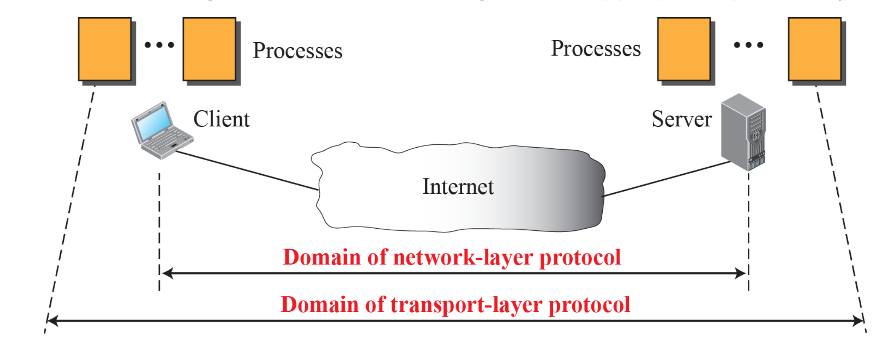

> **Process**: transport layer가 제공하는 service를 사용하는 application layer entity

- network layer: 대상 컴퓨터에만 메시지 전달 (host to host)
- transport layer: 적절한 프로세스에 메시지 전달 (process to process)
- 인터넷의 각 computer가 여러개의 task를 수행하는 것을 위해 디자인됨

## Addressing: Port number

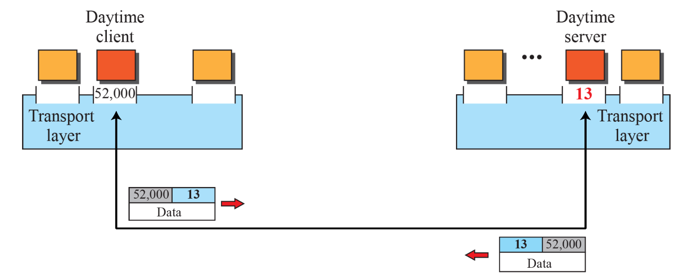

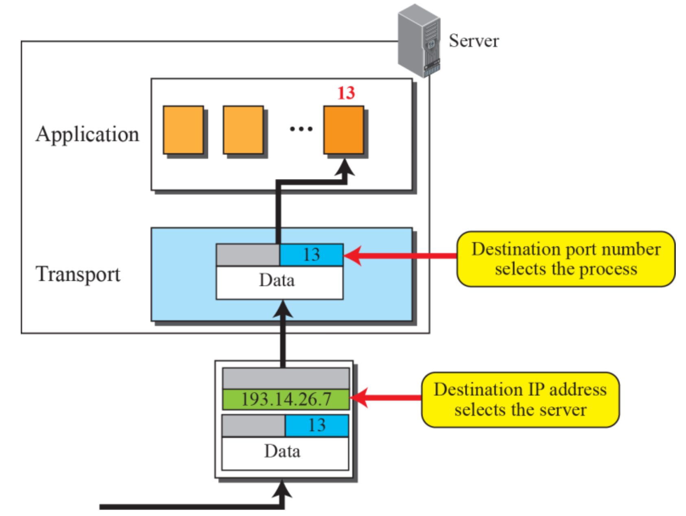

> IP address: 다른 host를 식별
>
> Port number: host 내의 프로세스를 식별

- 최근 운영 체제는 다중 사용자 및 다중 프로그래밍 환경을 모두 지원
- 통신을 위해서는 로컬 호스트, 로컬 프로세스, 원격 호스트, 원격 프로세스를 정의해야 함
  - 로컬 호스트와 원격 호스트는 **IP 주소** 를 사용하여 정의됨
- process에는 **port number** 라는 두 번째 식별자가 필요
  - TCP/IP protocol suite 에서는 0에서 65,535(16비트) 사이의 정수
- client port number ~ 보통 1023보다 큼
- server port number ~ **well known port number** (0~1023)

## ICANN Ranges

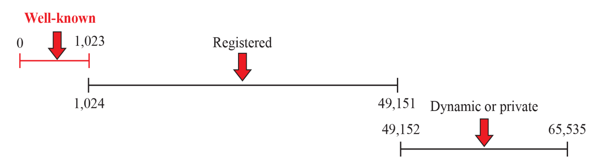

- Internet Corporation of Assigned Names and Numbers ~ port number를 3개의 범위로 나눔
  - **well-known port numbers**: 0~1023
    - HTTP(80), FTP(21), SMTP(25), DNS(53), Telnet(23),...
  - **registered port numbers**: 1024~49151
    - ICANN에 의해서만 등록 가능
  - **dynamic port numbers**: 49152~65535

>  `/ect/services` : well-known port numbers를 정의한 파일

## Socket Address

- **socket address**: IP address + port number
- transport layer service는 client/server socket address 쌍을 사용
  - network packet header: IP addresses 포함
  - transport layer packet header: port numbers 포함

## Encapsulation and decapsulation

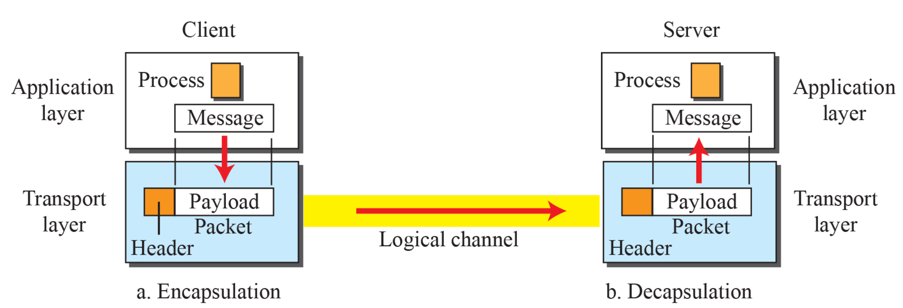

- Encapsulation: data 앞에 header를 붙임 - sender site
- Decapsulation: header를 제거하고 data (payload)를 추출함 - receiver site
- transport layer packet: **segment** or **user datagram**

## Multiplexing and demultiplexing

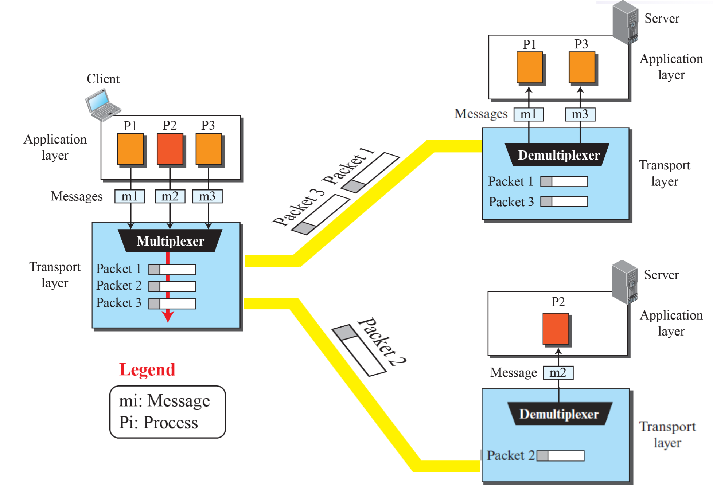

**multiplexing** (many-to-one)

- 여러 개의 아날로그 메시지 신호 또는 디지털 데이터 스트림을 공유 매체를 통해 하나의 신호로 결합하는 방식
- **source** 의 transport layer가 multiplexing 을 수행

**demultiplexing** (one-to-many)

- 다중화된 두 개 이상의 신호를 분리하는 것
- **destination** 의 transport layer가 demultiplexing 을 수행

## Flow Control

- producer 와 consumer 사이의 데이터 전송 속도 를 관리하여 consumer site 에서 데이터 항목의 손실을 방지
- packet이 소비하는 속도보다 producer가 생성하는 속도가 빠르면 consumer가 overwhelmed 됨
- packet이 소비하는 속도보다 producer가 생성하는 속도가 느리면 consumer가 idle 됨

### pushing and pulling

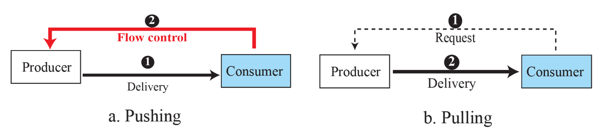

- 생산자(producer)로부터 소비자(consumer)에게 데이터를 전달하는 2가지 방식
- **pushing**: 소비자의 요청 없이 생산자가 데이터를 일방적으로 전달하는 방식
  - 서버가 클라이언트의 상태와 관계없이 계속 데이터를 보내는 상황
  - 소비자는 과도한 데이터로 인해 과부하에 빠질 수 있음
  - 버퍼가 가득 차고 패킷이 손실될 수 있음
  - 데이터를 **버리는 상황을 방지하기 위해 흐름 제어(flow control)** 가 필요

- **pulling**: 소비자가 먼저 요청한 후에야 생산자가 데이터를 전달하는 방식
  - 소비자가 처리할 수 있는 양만 요청하기 때문에 흐름 제어가 필요 없음
  - 웹 브라우저에서 페이지를 클릭해서 데이터를 요청하는 방식과 같음
  - 요청한 만큼만 데이터를 받기 때문에 수신 측에서 과부하나 데이터 손실이 발생할 가능성이 낮음

### flow control at transport layer

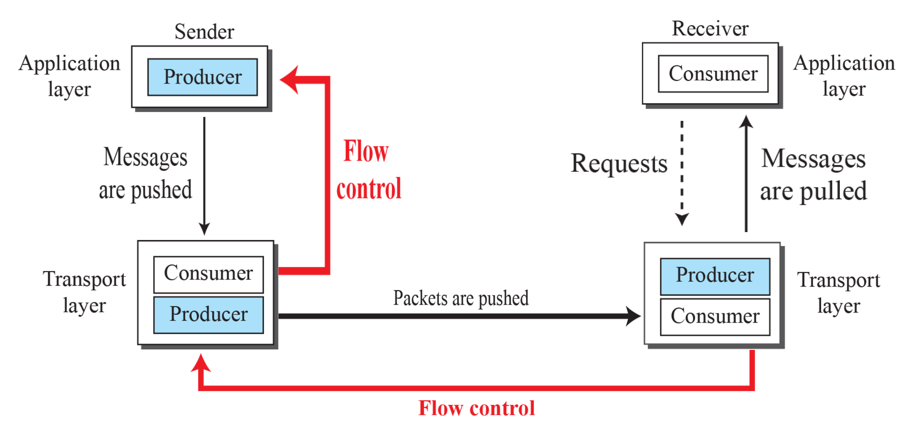

> sender process - sender transport layer 간의 flow control
> 
> sender transport layer - receiver transport layer 간의 flow control

- sender process
- sender transport layer
- receiver transport layer
- receiver process

## Error Control

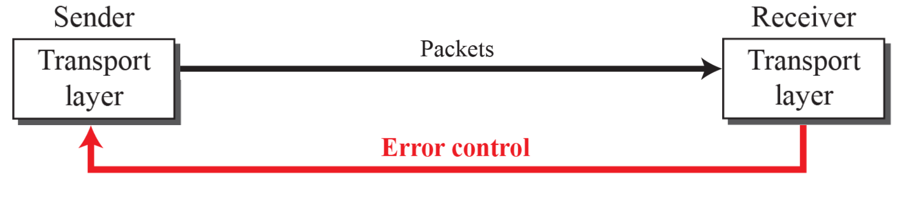

- 인터넷에서 하위 계층인 네트워크 계층은 신뢰성이 없기 때문에, **애플리케이션이 신뢰성을 요구하는 경우 전송 계층에서 신뢰성을 보장해야 함**
- 손상된 패킷을 감지하고 폐기
- 손실되거나 폐기된 패킷을 추적하고 재전송
- 중복된 패킷을 인식하고 폐기
- 순서가 맞지 않는(out-of-order) 패킷을 버퍼링하며 누락된 패킷을 기다림

### sequence number

- 오류 제어를 하려면 손상되거나 손실된 패킷, 중복된 패킷, 순서가 뒤바뀐 패킷 등을 정확히 식별할 수 있어야 함
- 패킷에 번호를 매기는 것이 필요
- transport layer 의 packet header 에 sequence number 를 저장하는 필드를 추가
- 헤더가 sequence number 에 **m 비트(bit)** 를 할당한다면, 사용 가능한 sequence number 는 `0` 부터 `2^m - 1`
- **한정된 비트 수(m)** 로 표현되므로, 일정 범위를 넘어서면 0부터 다시 시작

### signals

- positive signal: 패킷이 안전하게 도착했음을 알리는 신호
- negative signal: 패킷이 손실 / 손상되었음을 알리는 신호
- **Acknowledgment (ACK)** = positive signal
  - 수신자는 패킷이 잘 도착했을 경우 송신자에게 **ACK(응답 확인 신호)** 를 보내고, 손상된 패킷은 그냥 폐기할 수 있음
  - 송신자는 **타이머(timer)** 를 이용해 손실된 패킷을 감지할 수 있음
    - 패킷을 보낼 때, 송신자는 타이머를 시작
    - 타이머가 만료되기 전까지 ACK가 도착하지 않으면, 송신자는 해당 패킷을 재전송

## Connectionless and Connection-Oriented Services

### connectionless service

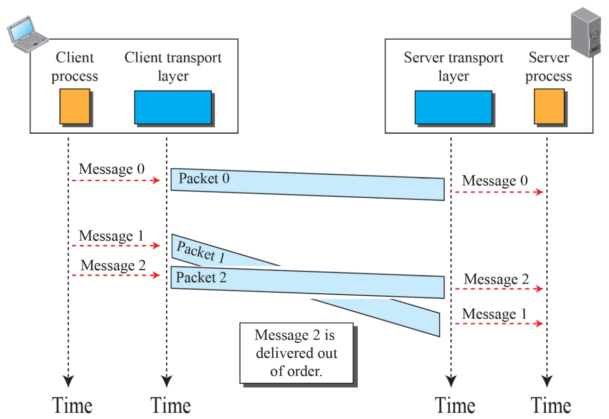

- **비연결형 서비스(connectionless service)** 란, 각 패킷 간에 독립성이 존재한다는 것을 의미
  - 송신 측과 수신 측 전송 계층 사이에 사전 합의나 연결 설정이 없음
  - 송신자는 **각 데이터 덩어리(chunk)** 를 서로 독립적인 단위로 처리하며, 이전이나 이후 패킷과의 관계를 고려하지 않음
  - 수신자는 패킷이 손실되었는지, 순서가 바뀌었는지 알 수 없음

### connection-oriented service

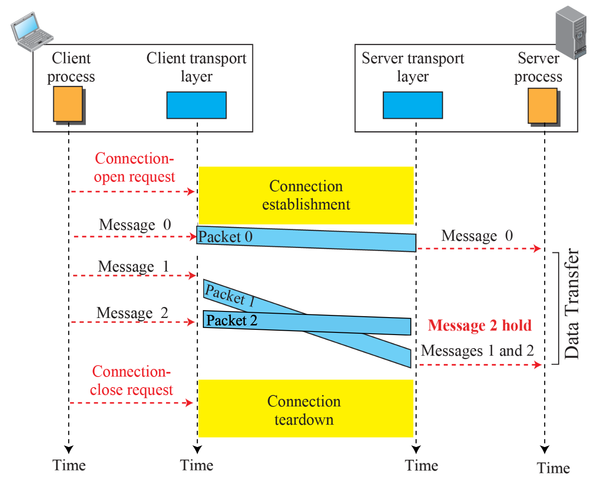

- **연결 지향형 서비스(connection-oriented service)** 란, 각 패킷이 서로 의존 관계에 있는 구조를 의미
- 클라이언트와 서버는 데이터를 주고받기 전에 **논리적인 연결(logical connection)** 을 먼저 설정해야 함

### Finite State Machine (FSM)

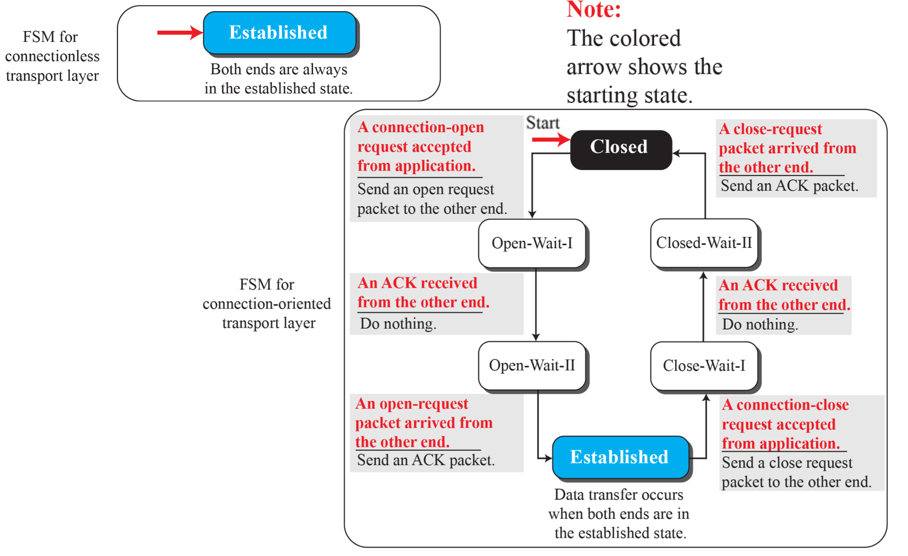

- transport layer 의 송신자 또는 수신자를 유한한 수의 상태를 가진 기계로 모델링
- 항상 특정 상태 중 하나에 머물고 있으며, 이벤트가 발생할 때만 상태가 변화
  - **실행해야 할 동작 목록을 정의 (필요 없는 경우 목록이 비어있을 수도 있음)**
  - **다음 상태를 결정 (현재 상태와 동일할 수도 있음)**