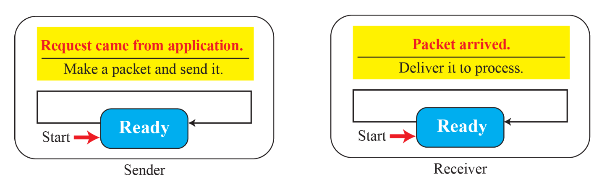

# Transport Layer Protocols

## Simple Protocol





- 비연결형(connectionless) 구조
- 흐름 제어(flow control)와 오류 제어(error control) 기능이 전혀 없는 구조
- 수신자는 도착한 모든 패킷을 즉시 처리할 수 있다고 가정
- 즉, 수신 측의 처리 능력에 제한이 없으며, 버퍼가 넘칠 일도 없다고 전제

## Stop-and-Wait Protocol


- 연결 지향형(connection-oriented) 전송 방식
- **흐름 제어(flow control)** 와 **오류 제어(error control)** 를 모두 사용하는 구조
- 송신자는 하나의 패킷을 전송한 뒤, 타이머를 시작하고, **수신자의 확인 응답(ACK)** 을 기다림
  - 타이머가 만료되기 전에 ACK가 도착하면, 송신자는 타이머를 멈추고 다음 패킷을 전송 (정상)
  - 타이머가 만료되면, 송신자는 이전 패킷을 재전송 (오류)
- **손상된 패킷을 감지하기 위해 체크섬(checksum)** 이 사용됨
  - 수신자는 체크섬 오류가 있는 경우 ACK를 보내지 않고 해당 패킷을 폐기
- 중복된 패킷을 받을 경우 폐기하고 ACK 보냄
- send / receive window 는 각각 unit size 1

### Bandwidth-Delay Product (BDP)

```
BDP = 대역폭 × 왕복 지연 시간
```

- 왕복 지연 시간(Round Trip Time, RTT) 동안 최대 전송할 수 있는 데이터 양

### Link Utilization 

```
이용률 (%) = 전송한 데이터 크기 / BDP * 100
```

### Pipelining

- 이전 패킷들에 대한 응답(ACK)을 기다리지 않고 여러 개의 패킷을 연속해서 전송하는 방식
- Stop-and-Wait 프로토콜은 파이프라이닝을 지원 X

## Go-Back-N Protocol (GBN)


- 전송 효율을 높이기 위해(즉, 전송 채널을 꽉 채우기 위해), 송신자가 ACK를 기다리는 동안에도 여러 패킷이 동시에 전송
- 송신자가 ACK를 기다리지 않고 여러 패킷을 연속으로 전송할 수 있지만, 수신자는 오직 하나의 패킷만 버퍼에 보관할 수 있음
- 즉, 수신자는 **순서대로 도착하지 않으면 패킷을 거부(discard)**
- 송신자는 각 패킷의 사본을 보관하고 있다가, ACK가 도착할 때까지 삭제하지 않음
- sequence number와 ACK number가 사용됨
- 네트워크에서 패킷 손실이 자주 발생하는 환경에서는, 이 방식이 비효율적
  - 하나만 손실돼도 그 이후 모든 패킷을 다시 보내야 하기 때문

### send window


- 데이터 패킷의 시퀀스 번호들을 포함하는 가상의 상자
- 동시에 전송 가능한 패킷들의 범위를 정의
- first outstanding: 아직 ACK를 받지 못한 가장 오래된 패킷의 시퀀스 번호
- next to send: 새로 전송할 다음 패킷의 시퀀스 번호
- 송신 윈도우의 크기 = 동시에 보낼 수 있는 최대 패킷 수
- error-free ACK을 받으면, 송신자는 송신 윈도우를 오른쪽으로 이동 (slide)
- **송신 윈도우 크기가 `2^m` 이상이면 → 이전 순서와 중복된 시퀀스 번호를 가진 패킷이 윈도우 내에 존재할 수 있게 됨**
  - 중복과 혼동을 피하기 위해, 송신 윈도우의 크기는 `2^m - 1` 이하의 값으로 설정해야 함

### receive window


- 수신 윈도우는 크기가 1인 가상의 상자
- 즉, 수신자는 딱 하나의 시퀀스 번호만 기대
- net expected: 수신자가 현재 기대하고 있는 다음 패킷의 시퀀스 번호
- next expected 와 일치하는 시퀀스 번호를 가진 패킷만이 수락되고, ACK가 전송
  - 그 외의 패킷은 **무시(discard)** 되며, ACK도 보내지 않거나 이전 번호로 반복 전송
- 정확한 패킷이 도착하면, 윈도우는 오른쪽으로 1칸 slide
  - 윈도우는 한 번에 한 슬롯만 이동

### cumulatvie ACK


- 수신자가 지금까지 순서대로 정확히 **수신한 마지막 패킷의 시퀀스 번호 + 1을 송신자에게 알려주는 방식**
  - 예: 수신자가 시퀀스 번호 0, 1, 2까지 정상 수신 → ACK(3) 전송
- 수신자가 ACK를 한 번 보낼 때, 그 **이전의 모든 패킷이 무사히 도착했음을 암시적으로 포함**
  - 중간에 ACK이 누락되어도 송신자는 이전 패킷이 정상 수신되었음을 알 수 있음

## Selective-Repeat Protocol (SR)


> 만약 m = 1이되면, 송신 / 수신 윈도우의 크기가 1이므로, Stop-and-Wait 프로토콜이 됨

- 실제로 손실된 패킷만을 선택적으로 재전송
- 송신 윈도우의 최대 크기은 `2^(m-1)` 이하 (GBN은 `2^m - 1` 이하)
- 순서가 뒤죽박죽 도착한 패킷들은 앞서 전송된 패킷이 도착할 때까지 기다렸다가, 그 후에야 **상위 계층(application layer)** 으로 전달

### why window size should be less or equal to `2^(m-1)`?


- 시퀀스 번호는 순환
- 수신자가 out-of-order 패킷을 버퍼에 보관하고 있기 때문에
- 시퀀스 번호가 반복되면 이게 새로운 패킷인지, 이전 버퍼에 있는 복사본인지 식별이 안 되는 문제가 생김
- **간단히 생각하면 송신 / 수신 윈도우가 각각 slide가 가능한 상황에서 두 윈도우의 크기 합이 `2^m`이 되어버리면 혼동이 발생 가능**