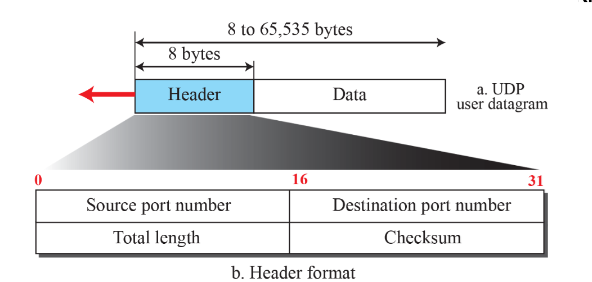
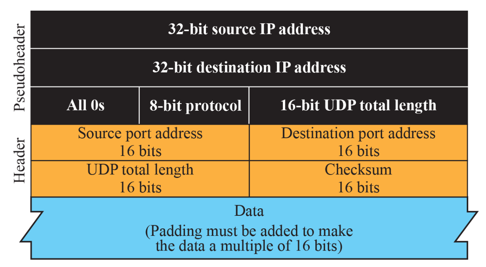

# User Datagram Protocol (UDP)

- connectionless, unreliable transport protocol
- simple protocol using a minimum of overhead

## User Datagram (UDP packet)



```
# hexadecimal format
CB84|000D|001c|001c

-> source port = CB84 = 52100
-> destination port = 000D = 13 (daytime)
-> length = 001c = 28 (header 8 bytes + data 20 bytes)
-> checksum = 001c = 28
```
- UDP 패킷은 8바이트 고정 크기 헤더를 가지며, 그 뒤에 데이터(payload)가 븥음
- Source Port (16 bits)
  - 송신 측 포트 번호
  - 응답을 받을 필요가 없거나, 포트를 지정하지 않아도 될 경우 0으로 설정 가능
- Destination Port (16 bits)
  - 수신 측의 포트 번호 → 반드시 존재해야 함
  - 해당 포트를 리스닝하고 있는 애플리케이션에게 데이터가 전달됨
- Total Length (16 bits)
  - 전체 UDP 데이터그램의 크기: Header(8 bytes) + Data
  - 최대 크기 = 65,535 바이트 (2바이트 표현 한계)
  - IP 패킷의 최대 크기 제한에 따라 실제로는 더 작아야 함
- Checksum (16 bits)
    -데이터그램에 오류가 없는지 확인하기 위한 필드

## Process-to-Process Communication

- 호스트 간 통신이 아니라 프로세스 간 통신을 위해 동작하는 전송 계층 프로토콜
- TCP처럼 연결 설정 없이 빠르고 단순한 데이터 전송을 지원
- 데이터를 **특정 호스트 내의 특정 프로세스(애플리케이션)** 에 전달하기 위해 **소켓 주소(socket address)** 를 사용

## Connectionless services

- 데이터그램을 보낼 때 연결 설정 및 해제 과정 없이 바로 전송
- **independent datagrams**: 순서도 없고, 추적도 안 함
- **no sequence number**: 데이터그램들끼리 번호가 매겨지지 않음
- **no connection establishment / termination** : SYN/ACK/FIN 같은 연결 관리 과정 없음, 각 패킷이 다른 경로로 전송될 수 있음
- **단일 Datagram 크기 제한**:
  - IP 패킷의 최대 크기: 65,535 바이트 (IPv4 기준)
  - IP 헤더: 20 바이트
  - UDP 헤더: 8 바이트
  - UDP 데이터: 최대 65,507 바이트 (65,535 - 20 - 8)

## Flow Control / Error Control

- 흐름 제어 없음
- checksum을 제외한 오류 제어 없음
- 송신자는 해당 패킷이 정상 수신됐는지 / 손실됐는지 / 중복됐는지 모름
- 수신자는 checksum을 통해 에러를 감지하면 그냥 패킷을 폐기

## Checksum



### Pseudo Header 구성 (IPv4 기준)

| 필드 이름           | 크기 | 설명 |
|----------------------|------|------|
| Source IP Address     | 32비트 | 송신자의 IP 주소 |
| Destination IP Address| 32비트 | 수신자의 IP 주소 |
| Zeros                 | 8비트  | 모두 0으로 채운 필드 |
| Protocol              | 8비트  | UDP는 `17` (10진수) |
| UDP Length            | 16비트 | UDP 헤더 + 데이터 길이 |

> **Protocol = 17**: 이 필드 덕분에 **TCP와 구별**됨  
> (TCP는 Protocol 번호 `6`)

### 계산 방식

1. Pseudo Header + UDP Header + Data를 16비트 단위로 분할
2. 모든 16비트 워드를 **1의 보수 덧셈(sum with carry)** 으로 합산
3. 결과값을 **1의 보수** 로 뒤집어서 checksum으로 사용

수신 측에서도 동일하게 계산해서, 결과가 `0xFFFF`이면 **데이터 무결성 보장**됨


### optional checksum calculation

| 상황 | 체크섬 필드 값 | 설명 |
|------|----------------|------|
| a. 체크섬 미사용 | `0x0000` | 체크섬 기능 끔 (IPv4만 허용) |
| b. 체크섬 사용, 합계 = 0xFFFF | `0xFFFF` | `0x0000`으로 착각 방지 위해 한 번 더 보수 |
| c. 합계 = 0x0000 | 불가능 | 모든 항목이 0이어야 함 → 현실적으로 불가능 |

- **IPv4**: 체크섬은 **optional (생략 가능)**  
  - 송신 측에서 checksum field를 모두 0으로 설정하면, 수신 측은 검사를 하지 않음
- **IPv6**: 체크섬은 **필수 (생략 불가)**  
  - UDP를 사용하는 경우 반드시 checksum 계산

## Congestion Control

- 네트워크 혼잡 상황을 감지하거나 조절하지 않음

## Encapsulation & Decapsulation

| 동작 | 설명 |
|------|------|
| Encapsulation | 메시지를 UDP 헤더와 함께 감싸서 IP 패킷에 포함 |
| Decapsulation | 수신 시, IP 패킷에서 UDP 헤더 제거 후 메시지 전달 |

## Queuing

| 구현 방식 | 설명 |
|-----------|------|
| 1. **입출력 큐 **모두 생성 | 각 포트에 대해 수신 큐 + 송신 큐 존재 |
| 2. **입력 큐만** 생성 | 수신한 패킷만 큐에 저장, 송신은 별도 처리 |

- 각 프로세스의 포트 번호를 기반으로 큐를 관리

## Multiplexing & Demultiplexing

- 여러 프로세스 → 하나의 UDP → 동일한 전송 채널(소켓) 공유 (multiplexing)
- 수신 시, UDP는 포트 번호를 보고 패킷을 해당 프로세스로 정확히 전달 (demultiplexing)

## UDP applications

- UDP는 우리가 흔히 기대하는 전송 계층의 신뢰성 요건들 — 데이터 재전송, 순서 보장, 흐름/혼잡 제어 등을 충족하지 못합
- 어떤 상황에서는 오히려 그 '비신뢰성'이 장점이 되기도
  - 작고 빠른 메시지 전송에 최적화
  - 지연(latency)에 민감한 애플리케이션
  - 애플리케이션 레벨에서 직접 제어 가능
  - 브로드캐스트 / 멀티캐스트 지원

### DNS는 왜 UDP를 사용하는가?

| 항목 | 설명 |
|------|------|
| **상황** | 클라이언트가 도메인 이름에 대한 IP 주소를 요청 |
| **특성** | 요청과 응답이 모두 짧고, 각 방향에 **한 번씩만 메시지 전송** |
| **적합성** | ✔ 요청/응답이 각각 1개의 UDP 데이터그램에 담길 수 있음 |
| **결과** | 연결 설정이 없는 UDP가 오히려 **지연을 줄이고 성능 향상** |

- DNS는 **짧은 요청/응답 1쌍**이면 끝나는 구조이므로  
- **순서 보장, 오류 복구, 연결 유지가 필요 없다** → UDP가 적절


### SMTP는 왜 UDP를 사용할 수 없는가?

| 항목 | 설명 |
|------|------|
| **상황** | 사용자가 긴 이메일을 전송 (멀티미디어 포함 가능) |
| **문제점** | 메시지가 **UDP의 최대 데이터 크기**를 초과함 |
| **결과** | 애플리케이션이 직접 데이터를 **분할해야 하며**, 수신 측에서 **재조합해야 함** |
| **위험 요소** | UDP는 순서를 보장하지 않음 → **조각들이 뒤섞일 수 있음** |
| **결론** | 메시지 재조합이 어려움 → **TCP처럼 신뢰성 있는 연결형 전송이 필수**

- 이메일 전송과 같이 **큰 데이터, 순서 유지가 중요한 경우**는  
- UDP의 연결 없음, 순서 없음 특성이 **오히려 문제**가 됨 → **TCP가 필요**

### 왜 정적파일 상황에 사용할 수 없는가?

| 항목 | 설명 |
|------|------|
| **상황** | 대용량 텍스트 파일을 다운로드 중 |
| **요구사항** | 파일의 **모든 부분이 정확하고, 손상되지 않아야 함** |
| **문제점** | UDP는 손실된 데이터에 대해 **재전송하지 않음** |
| **결과** | 파일 일부가 유실되거나 손상된 채로 저장될 수 있음 |
| **대응 방식** | **TCP 같은 신뢰성 있는 프로토콜 필요** (재전송, 순서 보장 포함) |


- 사용자는 "전체 파일"을 **완전히 받아야만 의미**가 있음  
- **지연(latency)은 괜찮지만, 데이터 손실은 치명적**

### Skype와 같은 실시간 애플리케이션에 왜 적합한가?

| 항목 | 설명 |
|------|------|
| **상황** | 실시간 화상/음성 채팅 (프레임 기반 스트리밍) |
| **요구사항** | **지연 최소화**, 실시간 동기화 유지 |
| **문제점** | 재전송이 발생하면 **전체 흐름이 끊김** → 사용자 체감 품질 저하 |
| **해결 방식** | 손상된 패킷은 그냥 무시 → **화면 일부분만 잠시 깨짐** |
| **결과** | 대부분 사용자는 **손실을 인지하지 못함**,  
→ 오히려 **재전송 없는 것이 유리**함


- 실시간성(real-time)이 **신뢰성보다 더 중요**  
- **재전송 대신 빠른 전달 우선** → 흐름 유지가 핵심


### UDP가 적합한지 판단하는 기준

> **"데이터 정확성"이 중요한가, 아니면 "전송 지연 최소화"가 중요한가?**

| 판단 기준                  | UDP 적합? |
|---------------------------|-----------|
| 실시간 송수신이 필요한가?    | ✅ |
| 일부 데이터 손실을 감내할 수 있는가? | ✅ |
| 전체 데이터가 반드시 정확해야 하는가? | ❌ |
| 전송 중 오류 발생 시 재전송이 필요한가? | ❌ |

- Trivial File Transfer Protocol (TFTP)
- multicasting
- Simple Network Management Protocol (SNMP)
- Routing Information Protocol (RIP)
- interactive real-time applications