# Transmission Control Protocol (TCP)

## Stream Delivery Service

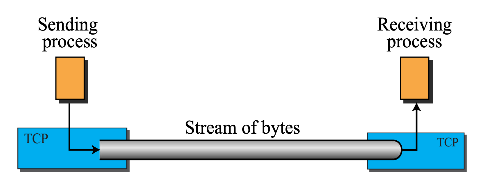

- TCP는 애플리케이션 간에 **연속된 바이트 스트림(stream of bytes)** 을 전송
- 바이트 스트림 전달 = "가상의 튜브" 연결
  - 송신 프로세스는 데이터를 한 줄로 나열된 바이트들의 스트림으로 전송
  - 수신 프로세스는 그 스트림을 순차적으로 읽어들임

### sending / recieiving buffers

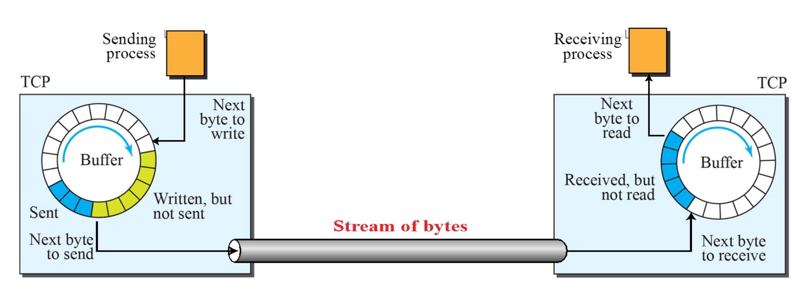

| 구성 요소 | 설명
| --- | --- |
| 송신 버퍼 | 송신자가 전송한 데이터를 일시 보관 |
| 수신 버퍼 | 수신자가 아직 읽지 않은 데이터를 보관 |
| 구현 방식 | 보통 1바이트 단위의 순환 배열(circular array) 사용 |

> 송신자와 수신자의 처리 속도가 다를 수 있음 → TCP는 이를 고려해서 흐름 제어(flow control) 수행

### segments

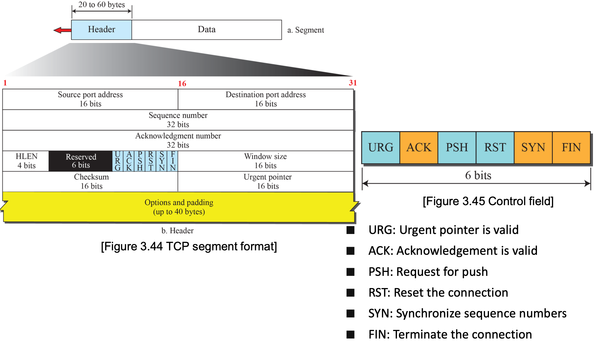

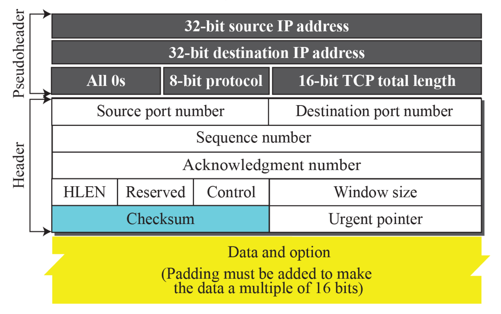

> protocol field value = 6 (TCP)

- TCP는 일정량의 바이트들을 **세그먼트(segment)** 라는 단위로 묶음
- 각 세그먼트에는 헤더(20~60 byte) 가 붙어 있어 제어 정보(시퀀스 번호 등)를 포함
- 세그먼트는 out-of-order, lost, corrupted 되거나 재전송될 수 있음

## TCP 핵심 매커니즘

**Full-Duplex Communication (전이중 통신)**

- 양쪽 방향으로 동시에 데이터 전송 가능
- 송신자와 수신자가 서로 독립적으로 데이터를 주고받을 수 있음
- 양방향 통신이 병렬적으로 가능하도록 각각의 송신/수신 버퍼와 상태 관리

**Multiplexing & Demultiplexing**

- Multiplexing: 송신 측에서 여러 애플리케이션의 데이터를 하나의 TCP 계층으로 보내기
- Demultiplexing: 수신 측에서 도착한 데이터를 포트 번호로 적절한 애플리케이션에 분배

**Connection-Oriented Service (연결지향 서비스)**

- 데이터 전송 전 **논리적 연결(logical connection)** 을 반드시 설정
- 3-way handshake

**Reliable Service (신뢰성 있는 데이터 전송)**

- TCP는 데이터를 손실 없이, 순서대로, 중복 없이 전달
- ACK (Acknowledgment) 기법 사용 → 수신자가 받은 바이트를 송신자에게 확인
- 손실된 경우 재전송, 중복된 세그먼트는 제거, 순서 뒤바뀐 경우 재정렬

## Byte Numbering & Acknowledgment

**Byte Number (바이트 번호)**

- TCP는 송신하는 **모든 바이트(=옥텟)**에 고유 번호를 부여
- 이 번호는 연속적인 스트림 기반 통신을 가능하게 함

**Sequence Number (시퀀스 번호)**

- 세그먼트마다 시작 바이트의 번호를 시퀀스 번호로 사용
- 초기 시퀀스 번호(ISN)는 **무작위(random)** 로 설정 (`0` ~ `2^32 - 1` 범위)

**Acknowledgment Number (응답 번호)**

- 수신자가 보낸 **다음에 기대하는 바이트 번호**를 알려줌
- 예: "시퀀스 번호 300부터 시작하는 세그먼트를 받았고, 다음은 350을 원해요" → ACK = 350

## TCP Connection

### Connection Establishment

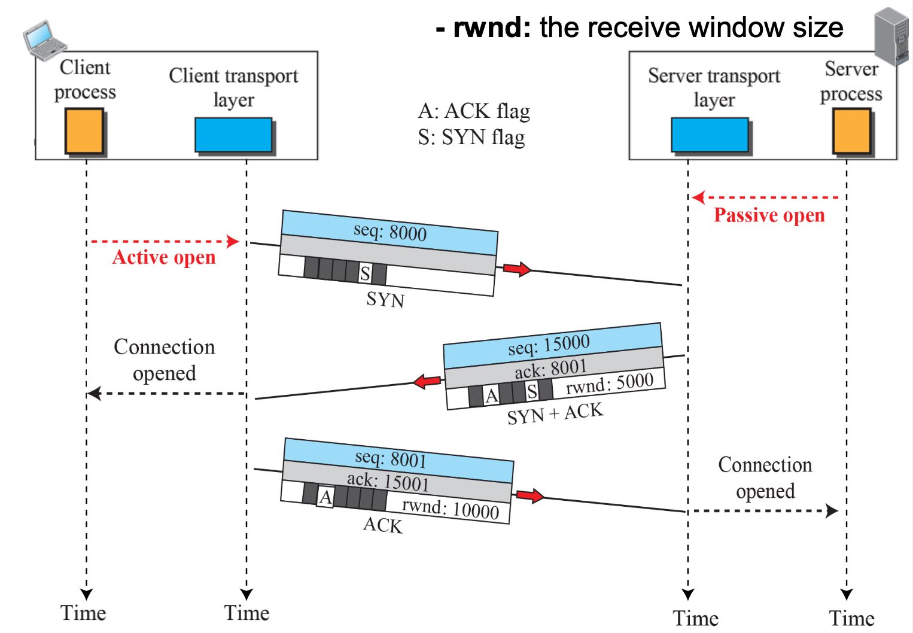

> TCP 연결은 양 측의 의사 확인 3 way handshake 를 이용하여 수행

1. Client → Server : `SYN`

   - 클라이언트가 연결 요청을 시작
   - SYN 플래그가 설정된 SYN segment 전송
   - 시퀀스 번호 client_isn 포함
   - rwnd (receive window) 정보도 포함됨
   - 데이터는 없지만 "1바이트"를 소비한 것으로 간주

2. Server → Client : `SYN` + `ACK`

   - 서버가 요청을 받고, 수락 의사 표시
   - SYN과 ACK가 모두 설정된 세그먼트 전송
   - 서버의 시퀀스 번호 server_isn 포함
   - ACK 번호 = client_isn + 1
   - 데이터는 없지만 "1바이트"를 소비한 것으로 간주

3. Client → Server : `ACK`

   - 클라이언트가 서버의 응답을 확인
   - ACK 플래그가 설정된 세그먼트 전송
   - ACK 번호 = server_isn + 1
   - 연결 성립 → 양방향 데이터 전송 가능

> **SYN Flooding Attack**
>
> - 공격자가 가짜 IP 주소로 다수의 SYN 패킷을 서버에게 보냄
> - 서버는 각각의 요청에 대해 SYN+ACK 전송 + 자원 할당 수행
> - 공격자는 응답(ACK)을 절대 보내지 않음 → handshake 미완료
> - 서버는 계속해서 리소스를 대기 상태로 점유
> - 정상 사용자의 요청은 처리할 수 없음 → DoS (Denial of Service) 상태

### Data Transfer

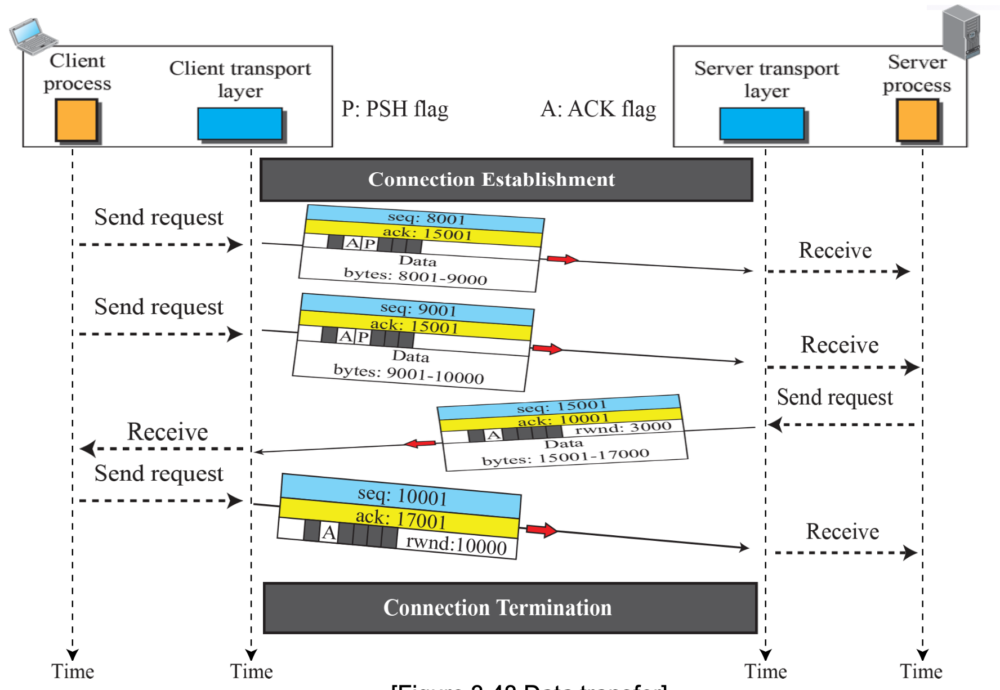

**수신 버퍼: 애플리케이션 준비 상태에 따라 유연 처리**

- TCP는 받은 데이터를 바로 애플리케이션에 넘기지 않을 수도 있음
- 수신된 데이터는 일단 TCP 버퍼에 저장
- 애플리케이션이 아직 준비되지 않았거나 느리게 처리하면, TCP가 대신 기다림
- 흐름 제어, 효율적인 리소스 관리

**PSH (Push) flag: 즉시 애플리케이션으로 전달 요청**

- 어떤 경우에는 수신 버퍼에서 지체 없이 바로 위 애플리케이션으로 넘겨야 함
- 송신 측이 세그먼트에 PSH (Push) 비트를 세팅
- 수신 측 TCP는 해당 데이터를 곧바로 애플리케이션에 전달

**URG (Urgent) flag: 우선순위 높은 긴급 데이터 처리**

- 애플리케이션이 "긴급한 데이터를 먼저 보내고 싶다"고 판단하는 경우 사용
- URG 비트 = 세그먼트에 긴급 데이터가 포함되었음을 표시
- Urgent Pointer = 긴급 데이터가 어디까지인지를 나타냄 (세그먼트의 시작부터 몇 바이트까지)

### Connection Termination

**3 way handshaking**

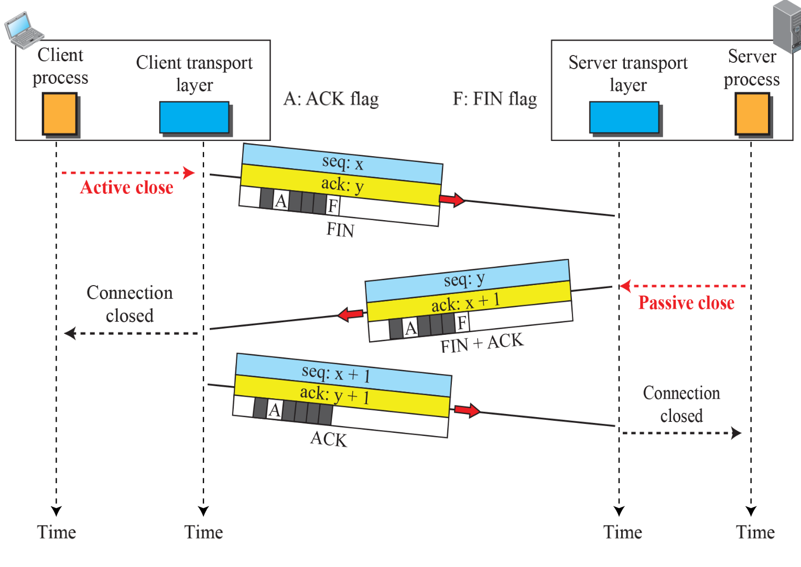

> TCP 연결을 완전히 종료하는 과정

| 단계 | 설명 |
| --- | --- |
| Step 1 | 클라이언트가 FIN 플래그를 보냄 (데이터 없음 → 1바이트 소비로 간주) |
| Step 2 | 서버는 이를 받고 ACK 응답 + 서버도 자신의 방향을 종료하기 위해 FIN 전송 |
| Step 3 | 클라이언트가 FIN을 받고 ACK 전송 → 종료 완료 |

**half-close**

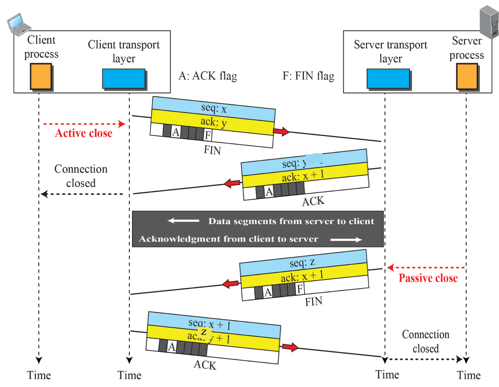

> 한 쪽은 전송을 종료하고, 다른 쪽은 계속 데이터 전송 가능, 
> 예시는 클라이언트가 종료하고 서버는 계속 데이터 전송

| 단계 | 설명 |
| --- | --- |
| Step 1 | 클라이언트가 FIN 전송 (더 이상 보낼 데이터 없음) |
| Step 2 | 서버는 ACK으로 수락 |
| Step 3 | 서버는 여전히 데이터를 계속 보낼 수 있음 (단방향 활성 상태) |
| Step 4 | 서버가 데이터 전송을 끝내고 FIN 보냄 |
| Step 5 | 클라이언트가 ACK 전송 후 완전 종료 |

### Connection Reset

- 연결을 비정상적으로 강제 종료하는 방법
- 연결 요청 거절 (Deny a connection request)
- 기존 연결 강제 중단 (Abort a connection)
- 유휴 연결 정리 (Terminate an idle connection)

## State Transition Diagram

**연결 설정 과정 (Connection Establishment)**

| 상태 | 설명 |
| --- | --- |
| `CLOSED` | 연결이 존재하지 않는 초기 상태 |
| `LISTEN` | 수동 열기 상태. 서버가 SYN 기다리는 중 (수신 대기) |
| `SYN-SENT` | 클라이언트가 SYN을 보낸 뒤, ACK를 기다리는 중 |
| `SYN-RCVD` | 서버가 SYN 받고 SYN+ACK를 보낸 뒤, ACK 기다리는 중 |
| `ESTABLISHED` | 3-way handshake 완료 후, 데이터 전송 가능한 상태 |

- 클라이언트: `CLOSED` → `SYN-SENT` → `ESTABLISHED`
- 서버: `CLOSED` → `LISTEN` → `SYN-RCVD` → `ESTABLISHED`

**연결 종료 과정 (Connection Termination)**

| 상태 | 설명 |
| --- | --- |
| `FIN-WAIT-1` | 클라이언트가 먼저 FIN을 보낸 상태 |
| `FIN-WAIT-2` | ACK를 받고, 상대방의 FIN을 기다리는 중 |
| `CLOSE-WAIT` | 서버가 FIN 받고, ACK는 보냈지만 아직 종료 준비 안 됨 |
| `LAST-ACK` | 서버도 FIN 보냈고, 마지막 ACK 기다리는 중 |
| `TIME-WAIT` | 클라이언트가 최종 FIN 받고 ACK 보낸 뒤, 2MSL 대기 |
| `CLOSING` | 양쪽이 둘다 종료하기로 결정된 상태 |

- 클라이언트: `ESTABLISHED` → `FIN-WAIT-1` → `FIN-WAIT-2` → `TIME-WAIT`
- 서버: `ESTABLISHED` → `CLOSE-WAIT` → `LAST-ACK` → `CLOSED`

## Windows in TCP

- 양방향 연결마다 총 4개의 윈도우를 사용
- 각 방향마다 **송신 윈도우(send window)** 와 **수신 윈도우(receive window)** 가 존재
- 데이터가 한쪽 방향으로 흐르는 단방향 통신을 가정하면, piggybacking (윈도우를 합치는 것) 가능

### send window

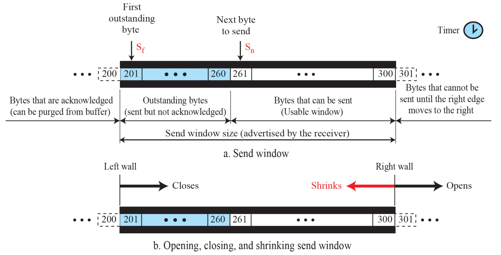

| 구간 | 설명 |
| --- | --- |
| 확인됨 (ACK’d) | 0~Sf-1: 이미 수신 측이 ACK 보낸 바이트들 → 버퍼에서 제거 가능 |
| Outstanding | Sf ~ Sn-1: 전송은 했지만 아직 ACK를 받지 못한 바이트들 |
| Usable (송신 가능) | Sn ~ right wall: 아직 전송되지 않았지만 보내도 되는 바이트들 |
| Blocked | right wall 이후: 아직 전송 불가 |

**Left wall closes**

- ACK가 도착하면, Sf 오른쪽으로 이동
- Outstanding → ACK’d로 이동
- 이미 확인된 데이터 버퍼에서 제거 가능


**Right wall opens**

```
# if
new ackNo + new rwnd > old ackNo + old rwnd

# then
sendable range = [new ackNo, new ackNo + rwnd)
```

- 수신 측의 수신 버퍼가 여유로워지면 Right wall 오른쪽으로 이동
- 즉, 수신자가 새로운 늘어난 rwnd를 광고하면 Right wall이 오른쪽으로 이동
- 송신 가능 데이터 영역 증가 → 전송률 향상

**Right wall shrinks**

```
# if
new ackNo + new rwnd < prev ackNo + prev rwnd

# then
sendable range = [new ackNo, new ackNo + rwnd)
```

- 수신 측 rwnd가 부족해지면 Right wall 왼쪽으로 이동
- 전송 가능 영역 감소 → 송신 제한
- 일부 구현에서는 보안과 일관성 문제로 shrinking을 허용하지 않음

### receive window

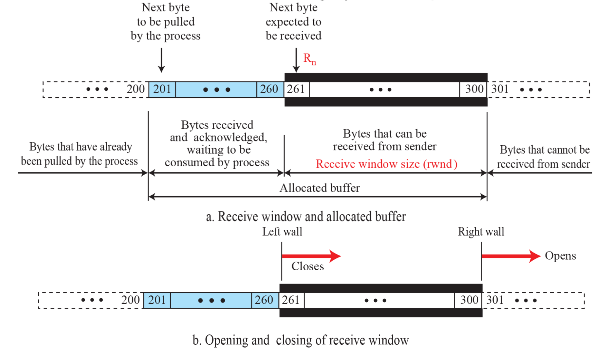

```
receive window size (rwnd) = (buffer size) - (number of wating bytes to be pulled)
```

| 구간 | 설명 |
| --- | --- |
| Pulled | 바이트 0~200: 이미 애플리케이션이 처리한 데이터 (버퍼에서 제거됨) |
| Waiting in buffer | 바이트 201~260: 수신 완료된 데이터 (acknowledged), 아직 애플리케이션이 읽지 않음 |
| Receivable | 바이트 261~300: 수신자는 여유 버퍼 있음 → 송신자가 전송해도 됨 |
| Blocked | 바이트 301~: 송신자로부터 수신이 불가능 한 영역 |

**Left wall closes**

- 송신자가로부터 byte를 수신하게 되면 left wall이 오른쪽으로 이동
- 수신 가능 영역(rwnd) 감소

**Right wall opens**

- 수신 측 애플리케이션이 데이터를 읽어내면 right wall이 오른쪽으로 이동
- 수신 가능 영역(rwnd) 증가

**cannot shrink**

- 프로토콜 규칙상 수신 측은 윈도우를 줄이지 않음 (수신자 혼란 방지)

## Flow Control

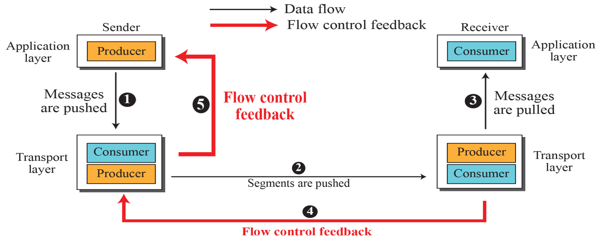

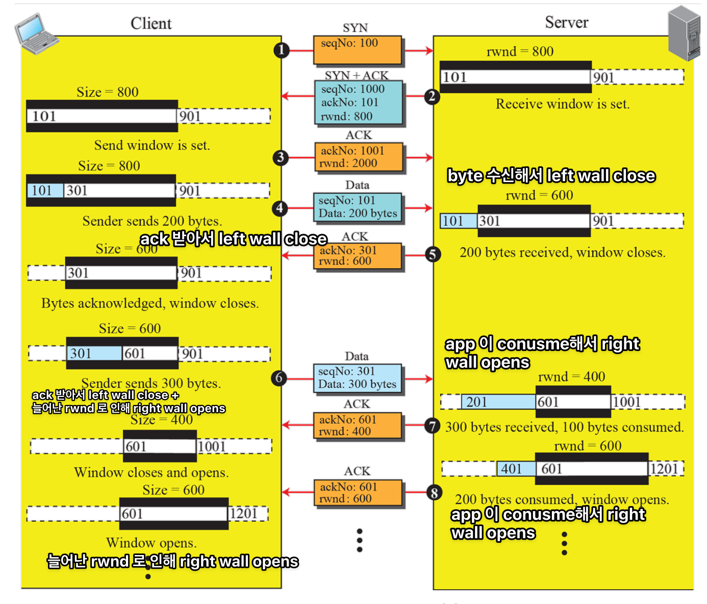

### silly window syndrome

- TCP에서는 데이터를 너무 작게 쪼개서 전송하면 헤더 오버헤드가 과도하게 커지고, 네트워크 효율이 급격히 떨어짐
- 송신 애플리케이션이 데이터를 조금씩 천천히 생성할 때, 작은 패킷들이 전송됨

**Nagle's Algorithm (for sender)**

- 네트워크 효율을 위해, 작은 데이터를 묶어서 전송하는 전략

1. 첫 데이터는 무조건 보냄 (1바이트여도 OK)
2. 그 후에는, ACK가 도착하기 전까지 새 데이터는 버퍼에 모아둠
3. 다음 두 조건 중 하나가 충족되면 다시 전송:
   - ACK 수신,
   - MSS(Max Segment Size)만큼 데이터 누적
4. 위의 과정을 모든 전송에 반복 적용

## Error Control

- Checksum: 데이터 손상 감지
- Acknowledgment (ACK): 수신 확인
- Retransmission: TCP의 핵심 복구 전략
  - 타이머 만료 (Timeout)되면 즉시 재전송
  - 세 개의 Duplicate ACK (Fast Retransmit)를 받으면 즉시 재전송
- Out-of-order Segment Handling: 순서 보장
  - 순서가 뒤바뀐 세그먼트는 버퍼에 저장
  - 중간에 빠진 세그먼트가 도착하면 → 버퍼에 저장된 것들과 함께 정렬 후 처리
- FSMs for Data Transfer: 상태 기반으로 전송 제어를 수행함

### Acknowledgment

**Cumulative ACK**

> SACK은 ACK를 대체하지 않음 → 보조 정보로 동작하며, TCP 옵션 사용을 허용한 경우에만 사용 가능

- 동작 방식:
  - 가장 마지막으로 순서대로 도착한 데이터까지의 범위를 ACK 번호로 알려줌
  - 예를 들어, 데이터 패킷이 1, 2, 3, 4, 5번 순서로 전송되었고, 1~3번 패킷이 도착했다면, ACK는 4를 보냄. 이는 "1, 2, 3번까지 제대로 받았고, 4번 이후부터는 다시 보내라"는 뜻
- 단점:
  - 중간에 누락된 패킷이 있다면 해당 누락된 패킷 이후의 모든 데이터는 재전송이 필요
  - 예: 1, 2, (3 손실), 4, 5 도착 → ACK는 여전히 3만 보내며 3번 이후의 데이터를 다시 요청

**Selective ACK (SACK)**

- 동작 방식:
  - TCP 옵션으로 구현되며, 누락된 패킷을 제외하고 어떤 데이터가 도착했는지 세부적으로 알려줌.
  - 예를 들어, 패킷 1, 2, 4, 5번이 도착하고 3번이 손실되었다면, SACK 옵션을 통해 "1-2번과 4-5번이 도착했다"고 보고함
송신자는 3번 패킷만 재전송하면 됨
- 장점:
  - 효율적인 데이터 전송. 누락된 패킷만 재전송하면 되므로 대역폭을 절약
  - 특히 대용량 데이터 전송에서 성능이 크게 향상.
- 단점:
  - 추가 메타데이터가 전송되어 헤더 크기가 약간 증가.

**6 rules for TCP ACK Generation**

| 규칙 번호 | 트리거 상황 | 행동 |
| --- | --- | --- |
| Rule 1 | 송신자가 데이터 전송 | 데이터에 ACK를 piggyback해서 함께 보냄 |
| Rule 2 | 수신자가 세그먼트 1개만 받은 상태 | ACK 전송을 잠시 지연 (보통 최대 500ms) |
| Rule 3 | 기대한 시퀀스 번호의 세그먼트 도착 + 이전 세그먼트 ACK 안 보냄 | 즉시 ACK 전송 |
| Rule 4 | 예상보다 높은 시퀀스 번호 도착 (out-of-order) | 즉시 ACK 전송 (누락 알림 목적) |
| Rule 5 | 누락된 세그먼트 도착 | 즉시 ACK 전송 (재정렬 완료 알림) |
| Rule 6 | 중복 세그먼트 도착 | 즉시 ACK 전송 (이미 받았음을 다시 알림) |

### Retransmission

> - RTO = Retransmission Timeout (고정값이 아님, RTT(Round-Trip Time) 기반으로 동적으로 조정)
> - RTT = 데이터가 목적지에 도달하고 ACK가 돌아오기까지 걸리는 시간

**RTO 기반 재전송 (Retransmission after RTO)**

| 단계 | 설명 |
| --- | --- |
| 1 | 송신자는 세그먼트 전송 후 RTO 타이머 시작 |
| 2 | 타이머가 만료되기 전까지 ACK가 도착하면 → 성공 |
| 3 | 타이머가 만료되면 → 해당 세그먼트 재전송 + 타이머 재시작 |

**Fast Retransmission (세 번의 Duplicate ACK 후 재전송)**

| 단계 | 설명 |
| --- | --- |
| 1 | 송신자가 한 세그먼트를 보냄 (예: Seq=1000) |
| 2 | 다음 세그먼트들이 도착 → ACK는 계속 같은 값(ACK=1000) 반복 |
| 3 | 동일한 ACK가 3번 연속 도착 → 손실된 세그먼트 존재로 간주 |
| 4 | RTO를 기다리지 않고 즉시 해당 세그먼트 재전송 |

## Deadlock created by lost ACK

> 수신 창 크기(rwnd)가 0이었다가 회복되었지만 ACK 손실로 인해 교착 상태에 빠지는 상황

1. 수신자가 rwnd = 0을 광고함
    
    - 수신자 버퍼가 가득 찼거나, 일시적으로 데이터를 받고 싶지 않아서
2. 송신자는 전송 중단

    - Send Window가 닫힘 → 새로운 데이터 전송 불가
    - 이제 송신자는 rwnd ≠ 0이 될 때까지 기다리는 중

3. 수신자가 버퍼 여유가 생김

   - 수신자가 rwnd 값을 회복 (예: 1000 바이트) 하고 이를 ACK에 포함해 송신자에게 보냄

4. 그런데 이 ACK가 손실됨

   - 송신자는 여전히 rwnd = 0인 줄로만 알고 데이터 전송 재개하지 않음
   - 수신자는 "송신자가 새로운 데이터를 보내겠지" 하고 기다림