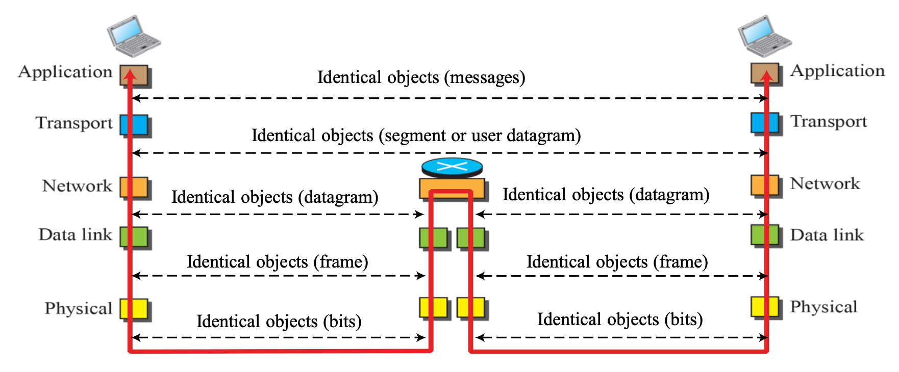
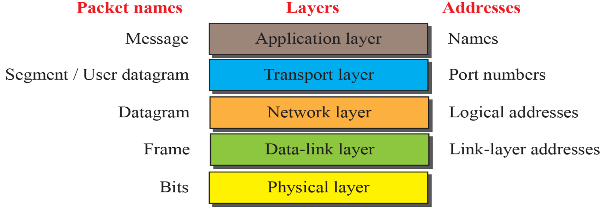

# Week 3 Q&A

## Problem 2

Which statements are True/False about Circuit Switched Networks (CSNs), and Packet Switched Networks (PSNs)?

> 회선 교환 네트워크와 패킷 교환 네트워크의 특징 중 옳은 것은?

A. In CSNs, a message is divided and grouped into units that are individually routed from the source to the destination

> 회선 교환 네트워크에서는 메시지가 작은 단위로 분할되어 각각의 단위가 독립적으로 목적지까지 경로를 선택하여 전송된다.
>
> 거짓 (False) - 이는 패킷 교환 네트워크의 특징입니다. 회선 교환 네트워크는 전체 메시지를 한번에 전송합니다.

B. Traditional telephone networks used PSNs since the networks are always available between the two end systems

> 전통적인 전화망은 패킷 교환 네트워크를 사용하고, 항상 두 end systems 간에 통신 경로가 있어야 한다.
>
> 거짓 (False) - 전통적인 전화망은 회선 교환 네트워크를 사용하며, 설명된 특징은 회선 교환 네트워크의 특성입니다.

C. CSNs have better resource utilization because they have dedicated connections between the source and the destination

> 회선 교환 네트워크는 두 end systems 간에 전용 회선을 가지고 있어, 자원을 효율적으로 사용한다.
>
> 거짓 (False) - 전용 회선은 사용하지 않을 때도 연결이 유지되어 자원이 낭비됩니다. 패킷 교환 네트워크가 자원을 더 효율적으로 사용합니다.

**D. PSNs are suitable for data transmission (정답)**

> 패킷 교환 네트워크는 데이터 전송에 적합하다.
>
> 참 (True) - 패킷 교환 네트워크는 데이터 전송에 최적화되어 있으며, 회선 교환 네트워크는 음성 전송에 더 적합합니다.

---

## Problem 3

Mobile Communication Systems Evolution:

| **약자**  | **전체 이름**                              | **세대** | **교환 방식**               |
| --------- | ------------------------------------------ | -------- | --------------------------- |
| **AMPS**  | Advanced Mobile Phone System               | 1G       | Circuit Switched            |
| **GSM**   | Global System for Mobile comm.             | 2G       | Circuit Switched            |
| **CDMA**  | Code Division Multiple Access              | 2G       | Circuit Switched            |
| **EDGE**  | Enhanced Data rates for GSM Evolution      | 2.5G     | CS (음성/SMS) + PS (데이터) |
| **UMTS**  | Universal Mobile Telecommunications System | 3G       | CS (음성/SMS) + PS (데이터) |
| **LTE**   | Long-Term Evolution                        | 4G       | Packet Switched             |
| **5G NR** | 5G New Radio                               | 5G       | Packet Switched             |

---

## Problem 4

Which of the following specific layers is/are not named in the TCP/IP model but is present in the OSI model?

> TCP/IP 모델에는 없지만 OSI 모델에는 있는 계층은 무엇인가요?

- **Presentation Layer**
- **Session Layer**

> TCP/IP의 Application Layer는 OSI 모델의 다음 세 계층의 기능을 통합하여 수행합니다:
>
> - Application Layer
> - Presentation Layer
> - Session Layer

---

## Problem 5

What are the data units (PDUs) at each layer of the TCP/IP protocol suite?

> TCP/IP 프로토콜의 각 계층별 데이터 단위(PDU)는 무엇인가요?

1. **Application Layer**: Message
2. **Transport Layer**: Segment (TCP) or User Datagram (UDP)
3. **Network Layer**: Datagram
4. **Data Link Layer**: Frame
5. **Physical Layer**: Bits

---

## Problem 6 & 7

What addressing is used at each layer of the TCP/IP protocol suite?

> TCP/IP 프로토콜의 각 계층별 주소 체계는 무엇인가요?

| **Layer**         | **PDU**               | **Addressing** |
| ----------------- | --------------------- | -------------- |
| Application Layer | Message               | Names, URLs    |
| Transport Layer   | Segment/User Datagram | Port Numbers   |
| Network Layer     | Datagram              | IP Addresses   |
| Data Link Layer   | Frame                 | MAC Addresses  |
| Physical Layer    | Bits                  | None           |

---

## Problem 8

What are the key characteristics achieved in circuit switching when resources are reserved between two communicating end systems?

> 회선 교환 방식에서 두 통신 종단 시스템 간에 자원을 예약할 때 얻을 수 있는 주요 특징은 무엇인가요?

- **Guaranteed constant rate of transmission**
- **Reliability**

> 회선 교환 방식의 주요 특징:
>
> - 전용 회선을 통한 일정한 전송 속도 보장
> - 전용 경로를 통한 신뢰성 있는 통신 보장

---

## Problem 9

In TCP/IP, a packet at the third layer carries data belonging to which layer and header belonging to which layer?

> TCP/IP의 3계층(네트워크 계층) 패킷은 어느 계층의 데이터와 어느 계층의 헤더를 포함하나요?

- **Data: Transport Layer (4th layer)**
- **Header: Network Layer (3rd layer)**

> TCP/IP의 데이터 캡슐화 과정에서:
>
> - 상위 계층의 데이터에 하위 계층의 헤더가 추가됨
> - 네트워크 계층 패킷은 전송 계층의 세그먼트를 데이터로 포함
> - 네트워크 계층의 헤더가 추가됨

---

## Problem 10

At which layers do various network devices operate in the TCP/IP model?

> TCP/IP 모델에서 다양한 네트워크 장비들은 어느 계층에서 동작하나요?

- **Physical Layer: Hubs, Cables, Repeaters**
- **Network Layer: Routers**

> 네트워크 장비의 동작 계층:
>
> - 물리 계층: 물리적 신호를 처리하는 기본 장비들 (허브, 케이블, 리피터)
> - 네트워크 계층: IP 주소를 기반으로 패킷을 라우팅하는 라우터
