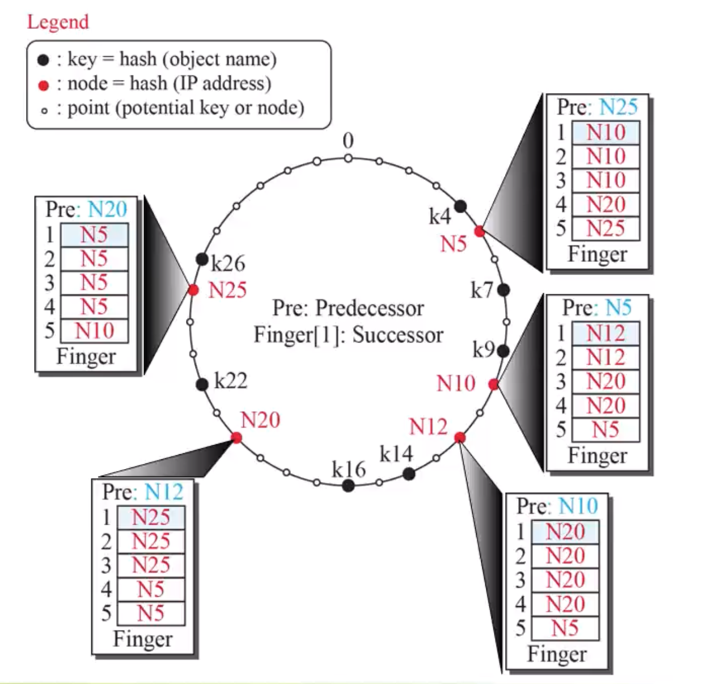

# Week 6 Q&A

## Problem 1

**Which statement(s) is/are TRUE about centralized and decentralized P2P networks?**  

> 중앙 집중형 및 분산형 P2P 네트워크에 대해 참인 설명은?

- **A. Both centralized and decentralized can use the Distributed Hash Table (DHT)**  
  
  > **False**  
  
  - DHT(분산 해시 테이블)는 **오직 분산형(decentralized) P2P**에서 사용됩니다.  
  - 중앙 집중형 시스템에서는 일반적으로 서버 기반 디렉터리를 사용합니다.

- **B. Peers in decentralized establish an overlay network**  
  
  > **True**  
  
  - 분산형 P2P에서는 **피어들이 직접 연결을 구성하며 오버레이 네트워크**를 형성합니다.

- **C. The directory system for decentralized P2P networks is randomly distributed between nodes**  
  
  > **True**  
  
  - 분산형 P2P에서는 디렉터리 시스템도 **분산 저장**되며, 각 노드가 일부 정보를 가집니다.

- **D. Gnutella is centralized whereas Freenet is decentralized**  
  
  > **False**  
  
  - Gnutella와 Freenet 모두 **분산형 P2P 네트워크**입니다.

---

## Problem 2

**Which statement(s) is/are TRUE about hashing?**  
> 해싱(Hashing)에 대해 참인 설명은 무엇인가?

- **A. Hashing is a mapping function**  
  
  > **True**  
  
  - **해싱은 식별자(identifier)를 값(value)으로 매핑하는 함수**입니다. 예: `hash(key) → ID`

- **B. Both Chord and Kademlia require to use a hash function**  
  
  > **True**  
  
  - **Chord와 Kademlia는 모두 해시 함수를 사용하여 키와 노드 ID를 주소 공간으로 매핑**합니다.

- **C. Handling node arrival requires running a hash function in both Chord and Kademlia**  
  
  > **True**  
  
  - 새 노드가 네트워크에 참여하려면 **해시 함수로 노드 ID를 계산**해야 합니다. 예: `node ID = hash(IP address)`

- **D. Chord can deal with node departure while Kademlia cannot**  
  
  > **False**  
  
  - Kademlia도 노드 탈퇴를 처리할 수 있으며, **replication 및 routing table 갱신**을 통해 이를 지원합니다.

---

## Problem 3

**Answering TRUE/FALSE in Chord:**  
> Chord 프로토콜에 대해 다음 문장의 참/거짓을 판단하시오.

- **A. The closest node to the key *k* will host the value *k***  
  
  > **False**  
  
  - Chord는 **key 이상(≥ k)을 만족하는 가장 가까운 노드 N**이 값을 저장합니다.  
  - 즉, "가장 가까운 노드"가 아니라 **시계 방향으로 이동하여 첫 번째로 나타나는 노드**가 호스트가 됩니다.

- **B. Each node in Chord stores information of *m* other nodes**  
  
  > **False**  
  
  - 각 노드는 **m개의 successor 노드**, 그리고 **하나의 predecessor**에 대한 정보를 유지합니다.  

- **C. Chord is typically a P2P lookup protocol**  
  
  > **True**  
  
  - Chord는 **P2P 환경에서 특정 키를 효율적으로 탐색**하기 위한 **lookup 프로토콜**입니다.

- **D. An identifier space of size 2^m points is distributed in a circle in the counterclockwise direction**  
  
  > **False**  
  
  - Chord는 **2^m 크기의 식별자 공간을 시계 방향(clockwise)** 으로 원형 구조에 따라 분배합니다.

---

## Problem 4

**Find the successors for the following keys**  
> 주어진 key에 대한 successor 노드를 찾으시오.

### Chord Identifier Circle 분석

- **검정 원**: 실제 노드 (`0`, `1`, `3`)
- **파란 상자**: key (예: `k = 1`, `k = 2`, `k = 6`)
- **식별자 공간**: 0 ~ 7 (총 8개의 포인트, `2^m` 크기)


| Key | Successor Node | 설명 |
|-----|----------------|------|
| 1   | 1              | key와 동일한 ID를 가진 노드가 존재함 → 해당 노드가 곧 successor |
| 2   | 3              | 시계 방향으로 가장 먼저 나타나는 노드는 `3` |
| 6   | 0              | 시계 방향으로 따라가면 `0`이 가장 가까운 노드 |


> 참고 정의:
> - **Successor**: 주어진 key *k*에 대해, **k 이상(≥ k)인 첫 번째 노드 N**이 그 key의 successor가 됨
> - 이는 **Chord에서 시계 방향(clockwise) 탐색**을 통해 결정됨

---

## Problem 5



**Find the successors for k14 received from N10**
> N10으로부터 수신한 k14에 대한 successor를 찾으시오.

1. N10은 k14의 successor가 아님
2. N10의 finger table row 중 k14 보다 작은 노드 중 가장 큰 노드인 N12를 찾음 (closet predecessor 찾아가는 과정)
3. N12의 `finger[1]` = N20 > k14 이므로 N12 = closest predecessor
4. k14의 successor는 N12의 `finger[1]` = **N20**

---

## Problem 6

**Answering TRUE/FALSE in Kademlia**  
> Kademlia 프로토콜에 대한 다음 설명의 진위를 판단하시오.


- A. Its routing table is also called finger table  
  
  > **False**

  - **finger table**은 **Chord**에서 사용하는 용어입니다.  
  - Kademlia에서는 **routing table**이라고 하며, **k-bucket** 구조를 따릅니다.

- B. Use XOR to calculate the distance between two nodes  
  
  > **True**

  - Kademlia는 거리 계산 시 **XOR 연산**을 사용합니다.  
  - 두 노드 간 거리: `distance(a, b) = a ⊕ b`  
  - 값이 작을수록 더 가까운 것으로 간주됩니다.

- C. Use NOR to calculate distance between keys  
  
  > **False**

  - Kademlia에서는 **NOR** 연산을 사용하지 않습니다.  
  - 거리 계산은 **오직 XOR** 연산만을 사용합니다.

- D. Assume N4, N7 and N11 are three active nodes, then key k8 is stored in N11  
  
  > **True**

  - k8 = `1000`  
  - XOR 거리 계산:

  ```
  8 ⊕ 4  = 12 (1100)
  8 ⊕ 7  = 15 (1111)
  8 ⊕ 11 = 3  (0011)
  ```

  - 가장 가까운 노드는 **XOR 결과가 가장 작은 N11**

---

## Problem 7

**In a Kademlia network, the identifier space is 256. Compute the following:**  
> Kademlia 네트워크에서 식별자 공간이 `256 = 2⁸`일 때, 다음 항목을 계산하시오.

### What is the number of leaf nodes?  
> **256개**

- **식별자 수 = 리프 노드 수**  
- 2⁸개의 ID가 있으므로 **256개의 리프 노드 존재**

### What is the number of rows, columns in each routing table?  
> **Rows = 8, Columns = 1**

- **row 수 = 비트 수 = 8**  
- 각 row는 **prefix 길이**에 해당하고, (0~2⁸-1)
- 각 row에는 **1개의 k-bucket (column)** 존재


### What is the number of subtrees that each node has?  
> **8개**

- 각 노드는 자신을 기준으로 **다른 prefix로 시작하는 노드 그룹**을 구분  
- 이로 인해 **8개의 subtree**를 형성


### What is the height of the tree?  
> **8**

- 식별자 공간이 2⁸이므로, 이진 트리의 **최대 깊이 = 8**

---

## Problem 8

**Choose the FALSE statement(s) about BitTorrent.**  
> BitTorrent에 대한 다음 설명 중 **거짓인 것**을 모두 고르시오.


- **A. In P2P, a peer always downloads files from one peer only**  
  > **False**  
  - BitTorrent는 **여러 피어로부터 병렬로 조각을 다운로드**하는 방식입니다.  
  - 하나의 피어에서만 다운로드하는 구조가 아닙니다.

- **B. A leech is a peer that has part of the file and wants to download the remaining portion**  
  > **True**  
  - **leech**는 아직 전체 파일을 받지 못한 상태에서 다른 피어로부터 **파일 일부를 받는 피어**를 의미합니다.

- **C. Every peer in a BitTorrent is called seed**  
  > **False**  
  - **seed**는 **전체 파일을 갖고 있는 피어**만을 의미합니다.  
  - 파일을 받는 중인 피어(leech)는 seed가 아닙니다.

- **D. All BitTorrent versions require a central node which acts as tracker**  
  > **False**  
  - **최근 BitTorrent는 DHT 기반 분산형 tracker**를 사용하여 **중앙 노드가 없이도 동작**합니다.

---

## Problem 9

**Which statements are TRUE/FALSE about Socket Interface?**  
> Socket Interface에 대한 다음 설명의 진위를 판단하시오.


- **A. There are five fields used in socket address structure**  
  > **False**  
  - 일반적으로 socket address 구조체에는 **4개의 필드**만 존재
  - `length`, `family`, `port number`, `IP address`
  - `unused`는 패딩을 위한 공간으로, 필드로 간주하지 않음

- **B. In TCP communication, because the server uses two different sockets – listen socket and socket, it creates both sockets for connection establishment**  
  > **False**  
  - 서버는 먼저 **listen socket**으로 대기하다가,  
  - 클라이언트가 연결하면 **새로운 소켓을 생성하여 데이터 송수신**에 사용함.  
  - 즉, **연결 후에 새 소켓이 생성**되며, 초기부터 두 개의 소켓이 동시에 존재하지는 않음.

- **C. In UDP communication, a server can serve multiple clients simultaneously**  
  > **True**  
  - UDP는 **비연결성**이기 때문에 하나의 socket으로 여러 클라이언트와 통신 가능

- **D. TCP communication can be iterative (serving a client at a time) or concurrent (serving several clients at a time)**  
  > **True**  
  - TCP는 **순차적 처리 (iterative)** 또는 **동시 처리 (concurrent)** 방식 모두 가능

--- 

## Problem 10

**Which statements are True/False about Socket Programming in four different languages?**  
> 네 가지 언어에서의 소켓 프로그래밍에 대한 다음 설명의 진위를 판단하시오.

- **A. In C, `SOCK_STREAM` is used for connectionless UDP communication, while `SOCK_DGRAM` is used for reliable, connection-oriented TCP communication.**  
  > **False**  
  - 실제로는 반대입니다:  
    - `SOCK_STREAM` → **TCP (연결 지향)**  
    - `SOCK_DGRAM` → **UDP (비연결성)**

- **B. C++ provides the `std::thread` class for thread management, allowing developers to create and control threads easily.**  
  > **True**  
  - C++의 `<thread>` 라이브러리는 `std::thread` 클래스를 제공하여,  
    - **간단한 쓰레드 생성 및 제어**가 가능합니다.

- **C. Python socket programming requires more complex syntax and external libraries, leading to larger and more convoluted code compared to Java, C, or C++.**  
  > **False**  
  - 오히려 Python은 **간결하고 직관적인 문법**,  
  - **내장 socket 라이브러리**를 통해 **가장 간단한 구현**이 가능합니다.

- **D. In Java, the server side of a socket connection is handled by the `ServerSocket` class. To handle multiple clients simultaneously, threads (`Thread`) are required.**  
  > **True**  
  - Java에서는 서버 소켓이 `ServerSocket`으로 구현되며,  
  - **동시 클라이언트 처리 시 `Thread` 클래스 사용**이 필요합니다.

---

## Problem 11

**In the server code, the line `serverSocket.bind(("", 12000))` is used in Python (or similar in Java). What is meant by "binding to an empty string" or `"0.0.0.0"`?**  
> python 서버 코드에서 `bind(("", 12000))` 또는 `bind("0.0.0.0", 12000)`로 바인딩할 때 의미는 무엇인가?


- **A. It binds only to the localhost interface (127.0.0.1)**  
  > **False**  
  - `127.0.0.1`로 바인딩하면 **오직 로컬 호스트**에서만 접근 가능  
  - 빈 문자열이나 `"0.0.0.0"`은 그보다 더 넓은 의미

- **B. It binds only to one specific client**  
  > **False**  
  - 바인딩은 **서버의 IP 인터페이스**를 결정하는 것이지, 클라이언트는 제한하지 않음

- **C. It allows the server to accept connections from any IP address**  
  > **True**  
  - `""` 또는 `"0.0.0.0"`로 바인딩하면  
  - **서버는 모든 NIC(네트워크 인터페이스)**에서 들어오는 연결 요청 수락 가능

- **D. It limits the server to local file access only**  
  > **False**  
  - 바인딩은 네트워크 주소와 관련된 것이며, 파일 시스템 접근과 무관
